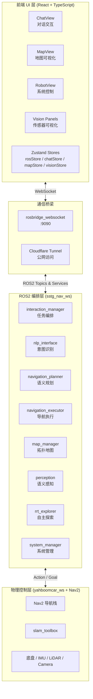
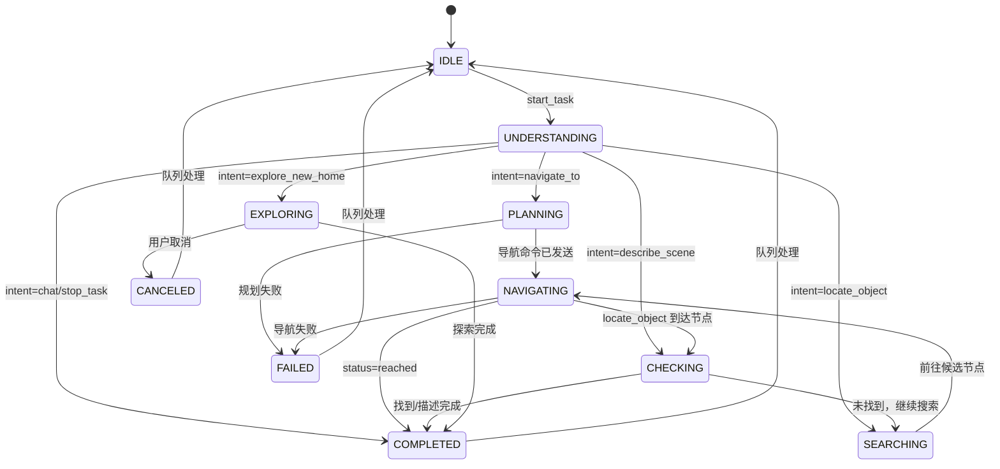
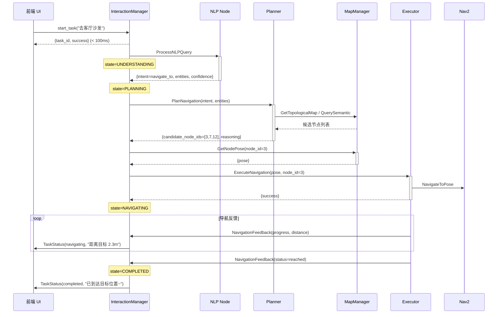
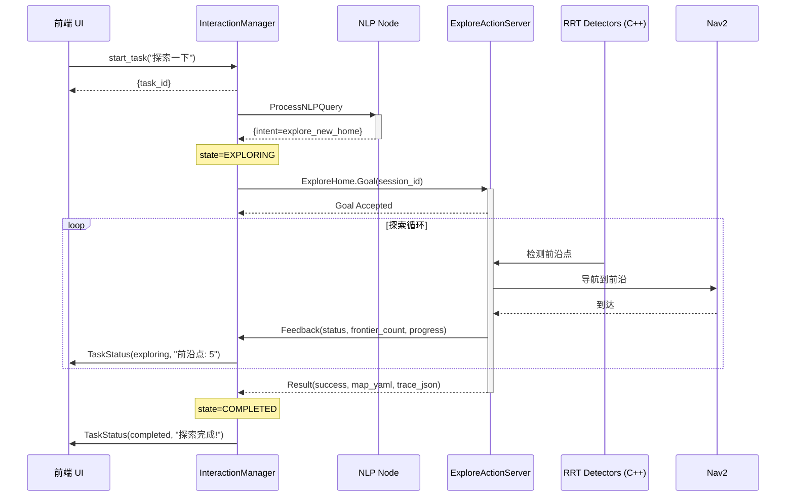
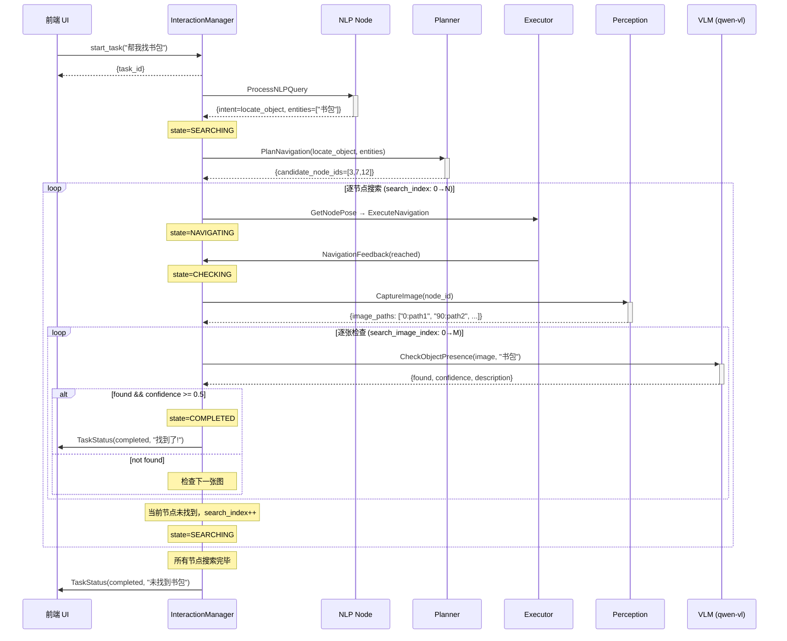

# SSTG V2 系统架构文档

> **版本**: V2.0  
> **日期**: 2026-04-14  
> **状态**: SSTG-V2 Production Ready  
> **下一版本**: V3 — 后端任务执行过程可视化  
> **文档定位**: SSTG 项目的系统级架构全景文档，任何新开发者或 AI agent 读完本文即可理解整个项目

---

## 目录

- [1. 文档说明](#1-文档说明)
- [2. 系统架构总览](#2-系统架构总览)
- [3. ROS2 接口契约](#3-ros2-接口契约)
- [4. 核心编排引擎: interaction_manager](#4-核心编排引擎-interaction_manager)
- [5. 四大任务流程详解](#5-四大任务流程详解)
- [6. 前后端通信桥梁](#6-前后端通信桥梁)
- [7. 各模块技术细节](#7-各模块技术细节)
- [8. 部署与启动](#8-部署与启动)
- [9. V3 扩展分析: 后端任务执行可视化](#9-v3-扩展分析-后端任务执行可视化)
- [附录 A: 关键文件路径速查表](#附录-a-关键文件路径速查表)
- [附录 B: 环境变量与配置参数](#附录-b-环境变量与配置参数)

---

## 1. 文档说明

### 1.1 定位与适用范围

本文档是 SSTG（Spatial Semantic Topological Graph）导航系统 V2 版本的系统级架构文档。它的核心目标是：

- **一文读懂全局**：覆盖后端 ROS2 架构、前端 React 架构、前后端通信机制、任务执行全流程
- **V3 开发参考**：V3 的核心目标是"后端任务执行过程可视化"，本文档详细记录了 V2 中所有数据流、接口契约和状态机，为 V3 扩展提供精确的切入点
- **Agent 友好**：结构化组织，任何 AI agent 加载本文件即可获得完整项目上下文

### 1.2 与其他文档的关系

| 文档 | 定位 | 与本文档的关系 |
|------|------|----------------|
| `README.md` | 项目入口、快速上手 | 本文档是其深度展开 |
| `SSTG_Quick_Reference.md` | 硬件规格速查 | 本文档引用但不重复硬件细节 |
| `SSTG_User_Guide.md` | 用户操作手册 | 本文档面向开发者，非用户 |
| `SSTG-Nav-Plan.md` | 早期架构设计 | 本文档反映实际实现现状 |
| 各模块 `MODULE_GUIDE.md` | 单模块详解 | 本文档提供跨模块全局视角 |
| `_WBT_WS_SSTG/doc/3.0_*.md` | V3 实施方案 | 本文档 Section 9 与之衔接 |

### 1.3 术语表

| 术语 | 全称 | 说明 |
|------|------|------|
| SSTG | Spatial Semantic Topological Graph | 空间语义拓扑图，本项目核心概念 |
| 拓扑节点 | Topological Node | 地图中的语义位置点，包含坐标、语义标签、全景图像 |
| VLM | Vision-Language Model | 视觉语言模型，当前使用 qwen-vl-plus |
| Nav2 | Navigation 2 | ROS2 标准导航栈 |
| rosbridge | ROS Bridge | ROS2 ↔ WebSocket 通信桥梁 |
| Intent | 意图 | NLP 解析出的用户意图类型 |
| TaskState | 任务状态 | interaction_manager 中的任务状态机 |
| Frontier | 前沿 | 已知区域与未知区域的边界，RRT 探索的目标 |
| RRT | Rapidly-exploring Random Tree | 快速随机探索树算法 |

---

## 2. 系统架构总览

### 2.1 三层架构

SSTG 系统分为三层：前端 UI 层、ROS2 编排层、物理控制层。



### 2.2 ROS2 包职责一览（10 个包）

| 包名 | 语言 | 核心节点 | 一句话职责 |
|------|------|----------|-----------|
| `sstg_msgs` | IDL | — | 定义所有自定义消息、服务、动作接口 |
| `sstg_interaction_manager` | Python | `interaction_manager_node` | 任务编排中枢，管理完整任务生命周期 |
| `sstg_nlp_interface` | Python | `nlp_node` | 自然语言理解，VLM 意图识别与实体提取 |
| `sstg_navigation_planner` | Python | `planning_node` | 语义匹配拓扑节点，生成候选导航目标 |
| `sstg_navigation_executor` | Python | `executor_node` | 调用 Nav2 执行导航，发布实时反馈 |
| `sstg_map_manager` | Python | `map_manager_node` | 拓扑地图 CRUD，语义查询，FastAPI WebUI |
| `sstg_perception` | Python | `perception_node` | RGB-D 图像采集，全景拍摄，VLM 语义标注 |
| `sstg_rrt_explorer` | C++/Python | `global/local_rrt_detector` | RRT 前沿探索，自动建图与节点放置 |
| `sstg_system_manager` | Python | `system_manager_node` | 系统健康监控，WebRTC 相机桥接 |

### 2.3 前端架构一览

**技术栈**: React 19 + TypeScript + Vite + Zustand + Three.js + Tailwind CSS + roslib.js

| 视图 | 文件 | 职责 |
|------|------|------|
| ChatView | `components/ChatView.tsx` | 对话交互、任务下发、状态展示、语音输入 |
| MapView | `components/MapView.tsx` | 2D 占据栅格地图、拓扑节点、机器人位姿 |
| RobotView | `components/RobotView.tsx` | 系统一键启动、节点管理、硬件状态 |
| GuideView | `components/GuideView.tsx` | 用户操作指南 |
| ArchitectureView | `components/ArchitectureView.tsx` | 系统架构交互图 |

| Store | 文件 | 职责 |
|-------|------|------|
| rosStore | `store/rosStore.ts` | ROS2 连接、Topic 订阅、Service 调用、机器人位姿、任务状态 |
| chatStore | `store/chatStore.ts` | 聊天历史、LLM 交互、会话管理 |
| mapStore | `store/mapStore.ts` | 地图数据、可视化状态 |
| visionStore | `store/visionStore.ts` | 传感器数据流（相机、深度、LiDAR） |

**传感器可视化组件**（`components/vision/`）:

| 组件 | 数据源 | 功能 |
|------|--------|------|
| CameraStreamPanel | `/camera/color/image_raw/compressed` | RGB 实时画面 |
| DepthColorPanel | `/camera/depth/image_raw` | 深度伪彩色 |
| DepthCloudPanel | 深度数据 | 3D 深度点云 (Three.js) |
| RGBDCloudPanel | RGB + Depth | RGBD 彩色点云 |
| LidarScanPanel | `/scan` | 2D 激光扫描极坐标图 |
| TeleopPanel | `/cmd_vel` | 手动遥控 |

### 2.4 部署拓扑

```
┌─────────────────────────────────────────────────────┐
│                    MaxTang NUC (FP750)               │
│                  Ubuntu 22.04 / ROS2 Humble          │
│                                                      │
│  ┌──────────────┐  ┌──────────────┐  ┌────────────┐ │
│  │ sstg_nav_ws  │  │ yahboomcar_ws│  │sstg_ui_app │ │
│  │ (ROS2 编排)  │  │ (硬件驱动)   │  │(Vite :5173)│ │
│  └──────┬───────┘  └──────┬───────┘  └─────┬──────┘ │
│         │                 │                 │        │
│         └────────┬────────┘                 │        │
│                  │                          │        │
│         ┌───────┴────────┐                  │        │
│         │ rosbridge :9090│◄─────────────────┘        │
│         └───────┬────────┘                           │
│                 │                                    │
│         ┌───────┴────────┐                           │
│         │ cloudflared    │                           │
│         └───────┬────────┘                           │
└─────────────────┼───────────────────────────────────┘
                  │
          ┌───────┴────────┐     ┌──────────────────┐
          │ Cloudflare CDN │     │ DashScope API    │
          │ iadc.sstgnav.  │     │ qwen-vl-plus     │
          │ cc.cd          │     │ (云端 VLM)       │
          └────────────────┘     └──────────────────┘
```

**硬件平台**: Yahboom X3 麦克纳姆轮全向底盘 + RPLidar S2 + Orbbec Gemini 330 + IMU  
（详细硬件规格见 `SSTG_Quick_Reference.md`）

---

## 3. ROS2 接口契约

> **V3 开发者注意**: 本节是理解"后端有哪些数据可以可视化"的关键。每个 msg/topic 都是潜在的可视化数据源。

### 3.1 消息类型（10 msg）

**TaskStatus.msg** — 任务状态（V3 核心扩展点）
```
string task_id              # 任务唯一标识
string state                # 当前状态（见 Section 4.2 状态机）
string current_message      # 面向用户的文本描述
string user_query_needed    # 需要用户确认时的提问
float32 progress            # 进度 0.0~1.0
string history              # 历史记录 JSON
```

**NavigationFeedback.msg** — 导航实时反馈
```
int32 node_id               # 目标节点 ID
string status               # 导航状态
float32 progress            # 导航进度
geometry_msgs/Pose current_pose  # 当前位姿
string error_message        # 错误信息
float32 distance_to_target  # 距目标距离 (m)
float32 estimated_time_remaining  # 预计剩余时间 (s)
```

**NavigationPlan.msg** — 规划结果
```
int32[] candidate_node_ids  # 候选节点 ID 列表
geometry_msgs/Pose[] poses  # 对应位姿
float32[] relevance_scores  # 语义相关度评分
string reasoning            # 规划推理说明
int32 recommended_index     # 推荐节点索引
```

**SemanticAnnotation.msg** — 语义标注结果
```
int32 node_id               # 节点 ID
string panorama_angle       # 全景角度
string image_path           # 图像路径
geometry_msgs/Pose pose     # 采集位姿
sstg_msgs/SemanticData semantic_data  # 语义数据
builtin_interfaces/Time timestamp
```

**SemanticData.msg** — 语义数据
```
string room_type            # 房间类型（如 living_room, kitchen）
float32 confidence          # 置信度
sstg_msgs/SemanticObject[] objects  # 物体列表
string description          # 场景描述
```

**SemanticObject.msg** — 语义物体
```
string name                 # 物体名称
string position             # 位置描述
int32 quantity              # 数量
float32 confidence          # 置信度
```

**GoalTraceEvent.msg** — 导航轨迹事件
```
std_msgs/Header header
int32 goal_id               # 目标 ID
string robot_name           # 机器人名称
string event_type           # 事件类型
geometry_msgs/Point point   # 位置点
int32 nav_status            # 导航状态码
```

**Command.msg** — 命令消息
```
string intent               # 意图类型
string target_object        # 目标物体
string target_room          # 目标房间
string[] constraints        # 约束条件
float32 confidence          # 置信度
string[] clarifications     # 澄清信息
```

**SystemStatus.msg** — 系统状态
```
string mode                 # 运行模式
float32 cpu_percent         # CPU 使用率
float32 memory_percent      # 内存使用率
string[] device_status      # 设备状态列表
int32 active_node_count     # 活跃节点数
builtin_interfaces/Time stamp
```

**PointArray.msg** — 点集合
```
geometry_msgs/Point[] points
```

### 3.2 服务接口（17 srv）

#### 核心任务链路

| 服务名 | 类型 | 请求 | 响应 | 调用者 → 提供者 |
|--------|------|------|------|-----------------|
| `/process_nlp_query` | ProcessNLPQuery | text_input, context, session_id, sender_name | success, query_json, intent, confidence, error_message | IM → NLP |
| `/plan_navigation` | PlanNavigation | intent, entities, confidence, current_node | success, candidate_node_ids, reasoning, plan_json | IM → Planner |
| `/execute_navigation` | ExecuteNavigation | target_pose, node_id | success, message | IM → Executor |
| `/get_node_pose` | GetNodePose | node_id | pose, success, message | Executor → MapMgr |

#### 地图管理

| 服务名 | 类型 | 请求 | 响应 |
|--------|------|------|------|
| `/get_topological_map` | GetTopologicalMap | (空) | success, message, topology_json |
| `/query_semantic` | QuerySemantic | query | node_ids, semantics, success, message |
| `/update_semantic` | UpdateSemantic | node_id, semantic_data | success, message |
| `/create_node` | CreateNode | pose | node_id, success, message |

#### 感知服务

| 服务名 | 类型 | 请求 | 响应 |
|--------|------|------|------|
| `/capture_image` | CaptureImage | node_id, pose | success, image_paths, error_message |
| `/annotate_semantic` | AnnotateSemantic | image_path, node_id | success, room_type, objects, confidence, description, error_message |
| `/check_object_presence` | CheckObjectPresence | image_path, target_object | found, confidence, description, error_message |

#### 系统管理

| 服务名 | 类型 | 请求 | 响应 |
|--------|------|------|------|
| `/get_system_status` | GetSystemStatus | (空) | mode, active_nodes, hardware_ok, device_status |
| `/launch_mode` | LaunchMode | mode | success, message, launched_nodes |
| `/restart_node` | RestartNode | node_name, kill_duplicates | success, message, killed_pids |
| `/update_llm_config` | UpdateLLMConfig | base_url, api_key, model | success, message |
| `/delete_chat_session` | DeleteChatSession | session_id | success, message |
| `/save_rrt_session` | SaveRrtSession | requested_prefix | success, message, session_id, map_yaml, map_pgm, trace_json |

### 3.3 动作接口（1 action）

**ExploreHome.action** — 自主探索建图
```
# Goal
string session_id           # 探索会话 ID
string map_prefix           # 地图文件前缀

# Result
bool success
string message
string map_yaml             # 生成的地图 YAML 路径
string trace_json           # 轨迹 JSON 路径

# Feedback
string status               # 当前探索状态
int32 frontier_count        # 剩余前沿数量
float32 progress            # 探索进度 0.0~1.0
```

### 3.4 Topic 清单

| Topic | 消息类型 | 发布者 | 订阅者 | 频率 | 用途 |
|-------|----------|--------|--------|------|------|
| `/task_status` | TaskStatus | interaction_manager | 前端 rosStore | 事件驱动 | 任务状态更新 |
| `/navigation_feedback` | NavigationFeedback | executor | 前端 rosStore, IM | ~10Hz | 导航实时反馈 |
| `/cmd_vel` | Twist | 前端 Teleop / Nav2 | 底盘驱动 | ~10Hz | 速度指令 |
| `/map` | OccupancyGrid | slam_toolbox | Nav2, 前端 | ~1Hz | 占据栅格地图 |
| `/scan` | LaserScan | LiDAR 驱动 | slam_toolbox, Nav2, 前端 | ~10Hz | 激光扫描 |
| `/odom` | Odometry | EKF | Nav2, 前端 | ~50Hz | 里程计 |
| `/tf` | TFMessage | 各节点 | 全局 | ~50Hz | 坐标变换 |
| `/camera/color/image_raw` | Image | 相机驱动 | perception | 15Hz | RGB 图像 |
| `/camera/color/image_raw/compressed` | CompressedImage | 相机驱动 | 前端 | 15Hz | 压缩 RGB |
| `/camera/depth/image_raw` | Image | 相机驱动 | perception, 前端 | 15Hz | 深度图像 |
| `/system_status` | SystemStatus | system_manager | 前端 rosStore | ~1Hz | 系统状态 |

### 3.5 接口扩展指南

新增消息/服务步骤：
1. 在 `sstg_msgs/msg/` 或 `sstg_msgs/srv/` 下创建 `.msg` / `.srv` 文件
2. 在 `sstg_msgs/CMakeLists.txt` 的 `rosidl_generate_interfaces` 中注册
3. `colcon build --packages-select sstg_msgs`
4. 在使用方的 `package.xml` 中添加 `<depend>sstg_msgs</depend>`

> **V3 提示**: V3 需要新增 `ObjectSearchTrace.msg` 和 `/object_search_trace` topic，详见 Section 9。

---

## 4. 核心编排引擎: interaction_manager

> **文件**: `sstg_nav_ws/src/sstg_interaction_manager/sstg_interaction_manager/interaction_manager_node.py` (1096 行)  
> **节点名**: `interaction_manager_node`  
> **角色**: SSTG 系统的"大脑"，协调所有下游服务，管理任务完整生命周期

### 4.1 异步回调链架构

interaction_manager 采用异步回调链设计，`start_task` 服务在 <100ms 内返回，后续通过 `/task_status` topic 推送实时状态。

```
start_task_callback (< 100ms 返回)
    └─ nlp_client.call_async() → _on_nlp_done
        ├─ navigate_to     → _start_planning → _on_plan_done → _on_pose_done → _on_exec_done
        ├─ explore_new_home → _handle_explore() → Action Client 反馈循环
        ├─ locate_object    → _handle_locate_object() → 多节点搜索循环
        ├─ describe_scene   → _handle_describe_scene() → 拍照 + VLM 描述
        ├─ stop_task        → _handle_stop_task()
        └─ chat             → 直接完成
```

**服务客户端**:

| 客户端 | 服务名 | 类型 | 用途 |
|--------|--------|------|------|
| `nlp_client` | `/process_nlp_query` | ProcessNLPQuery | NLP 意图识别 |
| `plan_client` | `/plan_navigation` | PlanNavigation | 路径规划 |
| `get_pose_client` | `/get_node_pose` | GetNodePose | 获取节点位姿 |
| `exec_client` | `/execute_navigation` | ExecuteNavigation | 发送导航目标 |
| `capture_client` | `/capture_panorama` | CaptureImage | 全景拍照 |
| `check_object_client` | `/check_object_presence` | CheckObjectPresence | VLM 物体检测 |
| `explore_client` | `/explore_home` | ExploreHome (Action) | 自主探索 |

### 4.2 TaskState 状态机



**10 个状态**:

| 状态 | 值 | 含义 |
|------|-----|------|
| IDLE | `idle` | 空闲，等待任务 |
| UNDERSTANDING | `understanding` | NLP 正在理解用户意图 |
| PLANNING | `planning` | Planner 正在规划路径 |
| NAVIGATING | `navigating` | Nav2 正在执行导航 |
| EXPLORING | `exploring` | RRT 自主探索中 |
| SEARCHING | `searching` | 找物体：正在搜索候选节点 |
| CHECKING | `checking` | 找物体：正在拍照/VLM 检查 |
| COMPLETED | `completed` | 任务完成 |
| FAILED | `failed` | 任务失败 |
| CANCELED | `canceled` | 任务已取消 |

### 4.3 _publish_status 机制（V3 核心扩展点）

`_publish_status()` 是所有后端状态到达前端的唯一通道（第 149 行）：

```python
def _publish_status(self, message: str, progress: float = 0.0):
    msg = TaskStatus()
    msg.task_id = self.current_task_id
    msg.state = state.value          # TaskState 枚举值
    msg.current_message = message    # 面向用户的文本
    msg.progress = progress          # 0.0~1.0
    msg.history = history_str        # 最近 20 条历史
    msg.user_query_needed = ''
    self.task_status_pub.publish(msg)
```

> **V3 关键洞察**: 当前 `_publish_status` 只传递文本 `message`，缺少结构化数据（如当前搜索的节点 ID、候选列表、检查图片路径等）。V3 需要新增专用 topic 传递结构化搜索追踪数据。

### 4.4 任务队列与 Watchdog

**任务队列**（第 116 行）:
- 最大队列长度: 5
- 忙碌时新任务入队，返回 `intent='queued'` + 队列位置
- 终态（COMPLETED/FAILED/CANCELED）后延迟 1s 自动处理下一条
- 取消时清空队列并逐条通知前端

**Watchdog**（第 121 行）:
- 每 10s 检查一次
- 30s 无活动 → 发布心跳提示"仍在处理中"
- 60s 无活动 → 超时失败
- `_publish_status` 每次调用都会重置活动时间

### 4.5 线程模型

- **Executor**: `MultiThreadedExecutor(num_threads=4)`
- **Callback Group**: 全局 `ReentrantCallbackGroup`，允许回调并发执行
- **线程安全**: `threading.Lock` 保护共享状态（task_state, candidates, history）
- **队列定时器**: `threading.Timer` 延迟处理下一条任务

---

## 5. 四大任务流程详解

### 5.1 navigate_to: 语义导航

用户说"去客厅沙发"，系统理解意图后规划路径并导航。



**状态转换**: IDLE → UNDERSTANDING → PLANNING → NAVIGATING → COMPLETED  
**涉及服务**: ProcessNLPQuery → PlanNavigation → GetNodePose → ExecuteNavigation  
**涉及 Topic**: `/task_status` (发布), `/navigation_feedback` (订阅)

### 5.2 explore_new_home: 自主探索建图

用户说"探索一下这个房间"，系统启动 RRT 前沿探索。



**状态转换**: IDLE → UNDERSTANDING → EXPLORING → COMPLETED  
**涉及接口**: ExploreHome Action (Goal/Feedback/Result)  
**RRT 组件**: global_rrt_detector (C++) + local_rrt_detector (C++) + frontier_detector (Python) + filter + assigner

### 5.3 locate_object: 多节点搜索闭环（V3 重点）

用户说"帮我找书包"，系统规划候选节点，逐个导航、拍照、VLM 检查。



**状态转换**: IDLE → UNDERSTANDING → SEARCHING ⇄ NAVIGATING ⇄ CHECKING → COMPLETED  
**搜索状态变量**:
- `search_target`: 目标物体名称
- `search_candidates`: 候选节点 ID 列表
- `search_index`: 当前搜索到第几个节点
- `search_images`: 当前节点的图片路径列表
- `search_image_index`: 当前检查到第几张图

**Fallback 机制**: 精确匹配失败 → 全局搜索（用 `navigate_to` + `entities=['*']` 获取所有节点）

> **V3 关键**: 这个流程中的每一步状态变化（当前节点、已访问节点、检查图片、置信度）都是 V3 需要可视化的数据。当前只通过 `_publish_status` 发送文本，V3 需要新增 `ObjectSearchTrace` 结构化消息。

### 5.4 chat: 纯对话

用户说"你好"或"你能做什么"，NLP 返回 `intent=chat`，直接完成。

**状态转换**: IDLE → UNDERSTANDING → COMPLETED  
**涉及服务**: 仅 ProcessNLPQuery  
**特点**: NLP 返回的 `chat_response` 直接作为 TaskStatus.current_message 发布

---

## 6. 前后端通信桥梁

### 6.1 rosbridge_websocket 连接机制

前端通过 `roslib.js` 连接 `rosbridge_websocket`，实现 ROS2 Topic/Service 的 WebSocket 透传。

**连接地址自动检测** (`rosStore.ts:68-83`):
- 本地开发: `ws://localhost:9090`
- 公网访问: `wss://<domain>/rosbridge`（Cloudflare Tunnel 代理）

**重连机制**: 断开后 3s 自动重连，重连后主动拉取 `/query_task_status` 和 `/system/get_status`

### 6.2 Topic 订阅映射表

后端 ROS2 Topic → rosbridge → Zustand Store → React 组件

| ROS2 Topic | 消息类型 | Store 字段 | 使用组件 | 说明 |
|------------|----------|------------|----------|------|
| `/navigation_feedback` | NavigationFeedback | `rosStore.robotPose` | MapView | 提取 current_pose → {x, y, theta} |
| `/task_status` | TaskStatus | `rosStore.taskStatus` | ChatView, MapView | {state, message, progress, taskId} |
| `/system/status` | SystemStatus | `rosStore.systemStatus` | RobotView | CPU/内存/设备/节点数 |
| `/system/log` | String | `rosStore.systemLogs` | RobotView | 最近 200 条日志 |
| `/map` | OccupancyGrid | `rosStore.occupancyGrid` | MapView | 节流 2s，{data, width, height, resolution, origin} |

### 6.3 Service 调用映射表

前端 UI 操作 → roslib.js Service Call → 后端 ROS2 Service

| 前端操作 | Store 方法 | ROS2 Service | 类型 |
|----------|-----------|--------------|------|
| 发送消息/导航指令 | `startTask()` | `/start_task` | ProcessNLPQuery |
| 取消任务 | `cancelTask()` | `/cancel_task` | Trigger |
| 系统启动/模式切换 | `launchMode()` | `/system/launch_mode` | LaunchMode |
| 获取系统状态 | `getSystemStatus()` | `/system/get_status` | GetSystemStatus |
| 重启节点 | `restartNode()` | `/system/restart_node` | RestartNode |
| 更新 LLM 配置 | `updateLLMConfig()` | `/system/update_llm_config` | UpdateLLMConfig |
| 删除聊天会话 | `deleteChatSession()` | `/nlp/delete_session` | DeleteChatSession |

### 6.4 chatStore 消息模型

`chatStore.ts` 管理聊天界面的消息流，与 `rosStore.taskStatus` 联动。

**消息结构** (`ChatMessage`):
```typescript
{
  id: string;
  role: "user" | "system" | "robot";
  content: string;
  timestamp: number;
  images?: ImageAttachment[];
  meta?: {
    intent?: string;        // NLP 意图
    confidence?: number;    // 置信度
    status?: string;        // 任务状态
    progress?: number;      // 进度
    steps?: StatusStep[];   // 状态步骤轨迹
  };
}
```

**任务状态集成**: ChatView 监听 `rosStore.taskStatus` 变化，将每次状态更新追加到当前 robot 消息的 `meta.steps` 中，形成步骤轨迹。关键状态字段:
- `isTaskOwner`: 标记当前前端是否拥有正在进行的 robot 消息
- `currentRobotMsgId`: 正在更新的 robot 消息 ID
- `localQueue`: 排队中的消息 (QueueItem[])
- `canceledTaskIds`: 用户已取消的任务 ID 集合
- IN_PROGRESS 状态: `understanding`, `planning`, `navigating`, `exploring`, `searching`, `checking`

**聊天持久化 (SSE)**:  
前端通过 Server-Sent Events (`/api/chat/events`) 实时同步聊天数据，支持多浏览器共享会话:
- 事件类型: `message_added`, `message_updated`, `session_created`, `session_switched`, `session_deleted`, `session_renamed`, `llm_config_updated`
- REST API: `POST /api/chat/sessions`, `PUT /api/chat/sessions/active`, `POST /api/chat/sessions/{id}/messages`, `PUT /api/chat/messages/{id}`

**聊天图片回复的双阶段机制** (`vite-plugins/chatSyncPlugin.ts`):  
用户发送消息后，在同一个 HTTP 请求内依次执行两个阶段：

| 阶段 | 机制 | 输出 |
|------|------|------|
| ① LLM 文字回复 | 用户消息 → LLM API (qwen/deepseek 等) 流式生成 → 第一条 `robotMsg` | "好的，我帮你查一下书包在哪" |
| ② 拓扑图片检索 | LLM 回复完成后，正则检测用户原文是否含"在哪/找/图片"等关键词 → `searchTopoForObject()` 本地搜索拓扑地图 JSON → 创建第二条 `imgMsg` 承载图片 | "在走廊(节点3)找到了相关图片~" + 图片附件 |

- 阶段①不涉及 ROS/NLP 节点，直接调用外部 LLM API
- 阶段②是纯本地代码逻辑（读 JSON + 匹配物体名 + 返回图片路径），不经过 LLM
- V3.3 改进: `searchTopoForObject()` 已支持 session 地图的 viewpoint 级搜索，只返回物体所在方向的图片（而非全部 4 张）
- **后续改进方向**: 考虑将阶段②与 ROS 端的 `QuerySemantic` 服务打通，实现实时语义查询而非静态 JSON 搜索；支持 interaction_manager 的物体搜索任务链（导航→拍照→VLM 确认）与聊天图片回复的联动

**LLM 配置**: 支持多 Provider（DashScope、DeepSeek、ZhipuAI、Ollama、OpenAI），配置通过 `/api/llm-config` 服务端持久化。

### 6.5 完整数据流向图

```
┌─────────────────────────────────────────────────────────────┐
│                        前端 (React)                          │
│                                                              │
│  ChatView ◄── chatStore ◄── rosStore.taskStatus              │
│  MapView  ◄── rosStore.robotPose + occupancyGrid             │
│  RobotView◄── rosStore.systemStatus + systemLogs             │
│                                                              │
│  startTask() ──► roslib.Service("/start_task") ──────────┐   │
│  cancelTask()──► roslib.Service("/cancel_task") ─────────┤   │
│  launchMode()──► roslib.Service("/system/launch_mode") ──┤   │
│                                                          │   │
│  roslib.Topic.subscribe ◄────────────────────────────────┤   │
└──────────────────────────────────────────────────────────┼───┘
                                                           │
                    ┌──────────────────────────────────────┤
                    │       rosbridge_websocket :9090       │
                    └──────────────────────────────────────┤
                                                           │
┌──────────────────────────────────────────────────────────┼───┐
│                     后端 (ROS2)                           │   │
│                                                          │   │
│  interaction_manager ──publish──► /task_status            │   │
│  executor            ──publish──► /navigation_feedback    │   │
│  system_manager      ──publish──► /system/status          │   │
│  slam_toolbox        ──publish──► /map                    │   │
│                                                          │   │
│  interaction_manager ◄──service── /start_task             │   │
│  interaction_manager ◄──service── /cancel_task            │   │
│  system_manager      ◄──service── /system/launch_mode     │   │
└──────────────────────────────────────────────────────────────┘
```

> **V3 关键**: 新增 `/object_search_trace` topic 后，前端需要在 rosStore 中新增订阅，并将结构化搜索数据分发到 MapView（节点染色）和 ChatView（时间线展示）。

---

## 7. 各模块技术细节

### 7.1 sstg_nlp_interface

**文件**: `sstg_nlp_interface/sstg_nlp_interface/nlp_node.py`  
**节点**: `nlp_node`  
**服务**: `/process_nlp_query`

**功能**:
- 多模态输入: 文本、音频、图像
- VLM 意图分类 (qwen-vl-plus via DashScope API)
- 实体提取: 从自然语言中提取目标物体、房间等
- 会话持久化: `~/.sstg_nav/chat_sessions/`

**意图类型**:

| Intent | 触发示例 | 后续流程 |
|--------|----------|----------|
| `navigate_to` | "去客厅" | Planner → Executor → Nav2 |
| `explore_new_home` | "探索一下" | ExploreHome Action |
| `locate_object` | "帮我找书包" | 多节点搜索循环 |
| `chat` | "你好" | 直接回复 |
| `describe_scene` | "看看周围" | 拍照 + VLM 描述 |
| `stop_task` | "停下来" | 取消当前任务 |

### 7.2 sstg_navigation_planner

**文件**: `sstg_navigation_planner/sstg_navigation_planner/planning_node.py`  
**节点**: `planning_node`  
**服务**: `/plan_navigation`

**核心组件**:
- `semantic_matcher.py`: 语义匹配 — 将 NLP 实体与拓扑节点的语义标签匹配
- `candidate_generator.py`: 候选点生成 — 生成 Top-K 候选节点 (默认 K=5)，按语义相关度排序

**规划流程**:
1. 接收 intent + entities
2. 调用 `/get_topological_map` 获取完整拓扑图
3. 语义匹配: 计算每个节点与目标的相关度
4. 过滤: 最低置信度阈值 0.3
5. 排序: 返回 Top-K 候选节点 + relevance_scores + reasoning

### 7.3 sstg_navigation_executor

**文件**: `sstg_navigation_executor/sstg_navigation_executor/executor_node.py`  
**节点**: `executor_node`  
**服务**: `/execute_navigation`  
**发布**: `/navigation_feedback` (NavigationFeedback)

**核心组件**:
- `nav2_client.py`: Nav2 NavigateToPose Action Client 封装
- `navigation_monitor.py`: 导航进度监控（距离、进度百分比）
- `feedback_handler.py`: 反馈消息构建与发布

**到达判定**: 位置误差 < 0.2m，朝向误差 < 0.1 rad

### 7.4 sstg_map_manager

**文件**: `sstg_map_manager/sstg_map_manager/map_manager_node.py`  
**节点**: `map_manager_node`  
**服务**: `/get_topological_map`, `/query_semantic`, `/update_semantic`, `/create_node`, `/get_node_pose`

**数据结构**:
- 底层: NetworkX 图 (节点 = 拓扑位置, 边 = 连通性)
- 持久化: JSON 文件 (`maps/topological_map_manual.json`)
- 每个节点: `{id, name, pose:{x, y, theta}, semantic_info:{room_type, objects, description}}`

**WebUI**: `map_webui.py` — FastAPI 服务 (端口 8000)，提供地图查询 REST API

### 7.5 sstg_perception

**文件**: `sstg_perception/sstg_perception/perception_node.py`  
**节点**: `perception_node`  
**服务**: `/capture_panorama`, `/annotate_semantic`, `/check_object_presence`

**全景采集**: 4 方向 (0°, 90°, 180°, 270°)，通过 `/cmd_vel` 控制机器人旋转  
**VLM 集成**: qwen-vl-plus (DashScope API)，环境变量 `DASHSCOPE_API_KEY`  
**图像存储**: `sstg_rrt_explorer/captured_nodes/node_X/`

**核心组件**:
- `camera_subscriber.py`: RGB-D 图像订阅
- `panorama_capture.py`: 全景拍摄控制
- `vlm_client.py`: VLM API 调用封装
- `semantic_extractor.py`: 语义信息提取

### 7.6 sstg_rrt_explorer

**目录**: `sstg_rrt_explorer/`  
**语言**: C++ (RRT 算法) + Python (前沿检测、导航控制)

**C++ 核心** (`src/`):
- `global_rrt_detector_ros2.cpp`: 全局 RRT* 探索，订阅 `/map`，发布 `/detected_points`
- `local_rrt_detector_ros2.cpp`: 局部 RRT，近机器人区域探索
- `functions.cpp`: RRT 工具函数 — `Norm()`, `Steer(eta)`, `Nearest()`, `isInsideMap()`
- `mtrand.cpp`: Mersenne Twister 随机数生成器

**Python 核心** (`scripts/`):
- `getfrontier_ros2.py`: 前沿检测 — 占据栅格 → 二值化 → Canny 边缘 → 轮廓 → 质心 → 世界坐标
- `frontier_opencv_detector_ros2.py`: OpenCV 前沿检测器
- `filter_ros2.py`: 前沿点过滤（去重、距离阈值）
- `assigner_ros2.py`: 前沿点分配（选择最优前沿导航）
- `rrt_trace_manager.py`: 轨迹记录与管理
- `auto_node_placer.py`: 自动在代价地图上放置拓扑节点
- `exploration_action_server.py`: ExploreHome Action Server 封装

**参数**: `eta` (RRT 步长, 默认 2.0)

### 7.7 sstg_system_manager

**文件**: `sstg_system_manager/sstg_system_manager/system_manager_node.py`  
**节点**: `system_manager_node`

**功能**:
- 系统健康监控 (CPU/内存/设备状态)
- 节点管理 (启动/停止/重启)
- 模式切换 (导航模式/探索模式)
- WebRTC 相机桥接 (`webrtc_camera_bridge.py` — aiohttp + aiortc)

**服务**: `/system/get_status`, `/system/launch_mode`, `/system/restart_node`  
**发布**: `/system/status` (SystemStatus), `/system/log` (String)

---

## 8. 部署与启动

### 8.1 三阶段部署流程

SSTG 系统的完整部署分三个阶段，每个阶段使用不同的 launch 文件：

**Phase 1: RRT 探索建图**
```bash
# 启动硬件 + SLAM + Nav2 + RRT 探索器
ros2 launch sstg_rrt_explorer rrt_exploration_full.launch.py
```
- 输出: PGM 占据栅格地图 + RRT 轨迹 JSON + 序列化位姿图
- 自动放置拓扑节点到代价地图上

**Phase 2: 拓扑语义采集**
```bash
# 启动硬件 + 定位 + Nav2 + 地图管理 + 感知
ros2 launch sstg_rrt_explorer navigation_full.launch.py
```
- 工作流: 点击地图点 → 导航到达 → 全景拍摄 → VLM 语义标注 → 更新拓扑图
- 输出: 带语义标注的拓扑地图 JSON

**Phase 3: 生产导航**
```bash
# 启动完整 SSTG 系统
ros2 launch sstg_interaction_manager sstg_full.launch.py
```
- 包含所有 7 个核心包 + rosbridge + system_manager

### 8.2 Launch 启动时序

**sstg_full.launch.py** 启动时序:

| 时间 | 节点 | 说明 |
|------|------|------|
| T=0s | `rosbridge_websocket` | WebSocket 桥梁 (端口 9090) |
| T=0s | `map_manager_node` | 拓扑地图管理 |
| T=0s | `system_manager_node` | 系统监控 |
| T=2s | `nlp_node` | NLP 意图识别 |
| T=2s | `planning_node` | 路径规划 |
| T=2s | `executor_node` | 导航执行 |
| T=2s | `perception_node` | 语义感知 |
| T=2s | `exploration_action_server` | 探索服务 |
| T=2s | `webrtc_camera_bridge` | WebRTC 相机 |
| T=5s | `interaction_manager_node` | 编排中枢（等待上游就绪） |

**rrt_exploration_full.launch.py** 启动时序:

| 时间 | 组件 | 说明 |
|------|------|------|
| T=0s | 硬件 (URDF, 底盘, IMU, LiDAR, TF) | 底层驱动 |
| T=3s | slam_toolbox (async) | SLAM 建图 |
| T=6s | Nav2 (controller, planner, BT) | 导航栈 |
| T=10s | RRT (global/local detector, filter, assigner) | 探索器 |

### 8.3 环境变量与配置

| 变量 | 用途 | 默认值 |
|------|------|--------|
| `DASHSCOPE_API_KEY` | VLM API 密钥 | (必须设置) |
| `ROS_DOMAIN_ID` | ROS2 域 ID | 0 |

**关键配置文件**:
- Nav2 参数: `sstg_rrt_explorer/param/common/nav2_params.yaml`
- 感知配置: `sstg_perception/config/perception_config.yaml`
- EKF 参数: `sstg_rrt_explorer/param/common/ekf_x3_override.yaml`
- 拓扑地图: `sstg_rrt_explorer/maps/topological_map_manual.json`

---

## 9. V3 扩展分析: 后端任务执行可视化

### 9.1 当前可视化能力盘点

| 数据 | 当前状态 | 前端展示 |
|------|----------|----------|
| 机器人位姿 | `/navigation_feedback` → rosStore.robotPose | MapView 实时显示 |
| 任务状态文本 | `/task_status` → rosStore.taskStatus | ChatView 步骤展示 |
| 占据栅格地图 | `/map` → rosStore.occupancyGrid | MapView 2D 地图 |
| 系统状态 | `/system/status` → rosStore.systemStatus | RobotView 仪表盘 |
| 拓扑节点 | 通过 Service 查询 | MapView 节点标记 |

### 9.2 缺失的数据通道

`locate_object` 搜索过程中，以下关键数据只存在于后端内存，前端无法获取：

| 缺失数据 | 后端变量 | 当前传递方式 | 问题 |
|----------|----------|-------------|------|
| 搜索目标物体 | `self.search_target` | 文本嵌入 message | 无结构化字段 |
| 候选节点列表 | `self.search_candidates` | 不传递 | 前端不知道搜索范围 |
| 当前搜索索引 | `self.search_index` | 文本嵌入 "第 2/5 个" | 无结构化字段 |
| 已访问/失败节点 | 无记录 | 不传递 | 前端无法染色 |
| 当前检查图片 | `self.search_images[idx]` | 不传递 | 前端看不到检查过程 |
| VLM 检查置信度 | `result.confidence` | 仅在找到时传递 | 中间结果丢失 |

### 9.3 建议扩展点

根据 V3 计划文档 (`_WBT_WS_SSTG/doc/3.0_[Plan]_object_search_realtime_visualization_20260414.md`)：

**新增消息**: `ObjectSearchTrace.msg`
```
std_msgs/Header header
string task_id
string target_object
string phase                    # planning / navigating / checking / found / not_found
string event_type               # 事件类型
string message
int32 current_node_id
int32[] candidate_node_ids
int32[] visited_node_ids
int32[] failed_node_ids
int32 current_candidate_index
int32 total_candidates
int32 current_image_index
int32 total_images
int32 current_angle_deg
string current_image_path
bool found
float32 confidence
string evidence_image_path
```

**新增 Topic**: `/object_search_trace`  
**发布者**: `interaction_manager` (在 `_handle_locate_object` 搜索循环的每个关键步骤发布)

**前端扩展**:
- `rosStore`: 新增 `objectSearchTrace` 状态字段 + Topic 订阅
- `MapView`: 候选节点染色（待访问/正在访问/已检查/命中/失败）
- `ChatView`: 搜索时间线 + 证据图展示

### 9.4 与 V3 计划文档的衔接

V3 实施的核心改动路径：

```
1. sstg_msgs/msg/ObjectSearchTrace.msg     ← 新增消息定义
2. interaction_manager_node.py             ← 在搜索循环中发布 trace
3. rosStore.ts                             ← 新增 topic 订阅
4. MapView.tsx                             ← 节点染色 + 轨迹线
5. ChatView.tsx                            ← 搜索时间线 + 证据图
```

本文档 Section 4 (编排引擎) + Section 5.3 (locate_object 流程) + Section 6 (前后端桥梁) 提供了 V3 实施所需的全部上下文。

---

## 附录 A: 关键文件路径速查表

### 后端 ROS2 (sstg_nav_ws/src/)

| 文件 | 用途 |
|------|------|
| `sstg_interaction_manager/sstg_interaction_manager/interaction_manager_node.py` | 编排引擎 (1096 行) |
| `sstg_nlp_interface/sstg_nlp_interface/nlp_node.py` | NLP 节点 |
| `sstg_navigation_planner/sstg_navigation_planner/planning_node.py` | 规划节点 |
| `sstg_navigation_planner/sstg_navigation_planner/semantic_matcher.py` | 语义匹配 |
| `sstg_navigation_planner/sstg_navigation_planner/candidate_generator.py` | 候选点生成 |
| `sstg_navigation_executor/sstg_navigation_executor/executor_node.py` | 执行节点 |
| `sstg_navigation_executor/sstg_navigation_executor/nav2_client.py` | Nav2 客户端 |
| `sstg_map_manager/sstg_map_manager/map_manager_node.py` | 地图管理 |
| `sstg_map_manager/sstg_map_manager/topological_map.py` | 拓扑图数据结构 |
| `sstg_perception/sstg_perception/perception_node.py` | 感知节点 |
| `sstg_perception/sstg_perception/vlm_client.py` | VLM API 封装 |
| `sstg_rrt_explorer/src/global_rrt_detector_ros2.cpp` | 全局 RRT (C++) |
| `sstg_rrt_explorer/src/local_rrt_detector_ros2.cpp` | 局部 RRT (C++) |
| `sstg_rrt_explorer/src/functions.cpp` | RRT 工具函数 |
| `sstg_rrt_explorer/scripts/getfrontier_ros2.py` | 前沿检测 |
| `sstg_rrt_explorer/scripts/exploration_action_server.py` | 探索 Action Server |
| `sstg_system_manager/sstg_system_manager/system_manager_node.py` | 系统管理 |
| `sstg_msgs/msg/*.msg` | 消息定义 (10 个) |
| `sstg_msgs/srv/*.srv` | 服务定义 (17 个) |
| `sstg_msgs/action/ExploreHome.action` | 动作定义 |

### 前端 React (sstg_ui_app/src/)

| 文件 | 用途 |
|------|------|
| `App.tsx` | 应用入口，路由，访问密钥 |
| `store/rosStore.ts` | ROS2 连接、Topic 订阅、Service 调用 |
| `store/chatStore.ts` | 聊天消息、LLM 配置、会话管理 |
| `store/mapStore.ts` | 地图数据状态 |
| `store/visionStore.ts` | 传感器数据流 |
| `components/ChatView.tsx` | 对话界面 |
| `components/MapView.tsx` | 地图可视化 |
| `components/RobotView.tsx` | 系统控制中心 |
| `components/vision/CameraStreamPanel.tsx` | RGB 相机流 |
| `components/vision/LidarScanPanel.tsx` | LiDAR 可视化 |
| `components/vision/TeleopPanel.tsx` | 遥控面板 |

### Launch 文件

| 文件 | 用途 |
|------|------|
| `sstg_interaction_manager/launch/sstg_full.launch.py` | 生产导航全栈 |
| `sstg_rrt_explorer/launch/rrt_exploration_full.launch.py` | RRT 探索全栈 |
| `sstg_rrt_explorer/launch/navigation_full.launch.py` | 定位 + 导航 |
| `sstg_rrt_explorer/launch/library/hardware_bringup.launch.py` | 硬件启动 |

### 配置与数据

| 文件 | 用途 |
|------|------|
| `sstg_rrt_explorer/maps/topological_map_manual.json` | 拓扑地图 |
| `sstg_rrt_explorer/maps/*.yaml` + `*.pgm` | 占据栅格地图 |
| `sstg_rrt_explorer/param/common/nav2_params.yaml` | Nav2 参数 |
| `sstg_perception/config/perception_config.yaml` | 感知配置 |

---

## 附录 B: 环境变量与配置参数

| 变量/参数 | 位置 | 说明 |
|-----------|------|------|
| `DASHSCOPE_API_KEY` | 环境变量 | VLM API 密钥 (必须) |
| `ACCESS_KEY` | `App.tsx` | 前端访问密钥: `sstg2026` |
| rosbridge 端口 | `sstg_full.launch.py` | 9090 |
| Vite 开发端口 | `vite.config.ts` | 5173 |
| FastAPI 地图端口 | `map_webui.py` | 8000 |
| Cloudflare Tunnel | systemd service | `iadc.sstgnav.cc.cd` |
| Nav2 控制频率 | `nav2_params.yaml` | 20 Hz |
| 相机分辨率 | `orbbec_stable.launch.py` | 640x480 @ 15fps |
| RRT 步长 eta | `global_rrt_detector` | 2.0 |
| 语义匹配阈值 | `planning_node` | 0.3 |
| 物体检测阈值 | `interaction_manager` | 0.5 |
| Watchdog 超时 | `interaction_manager` | 30s 警告 / 60s 超时 |
| 任务队列上限 | `interaction_manager` | 5 |
