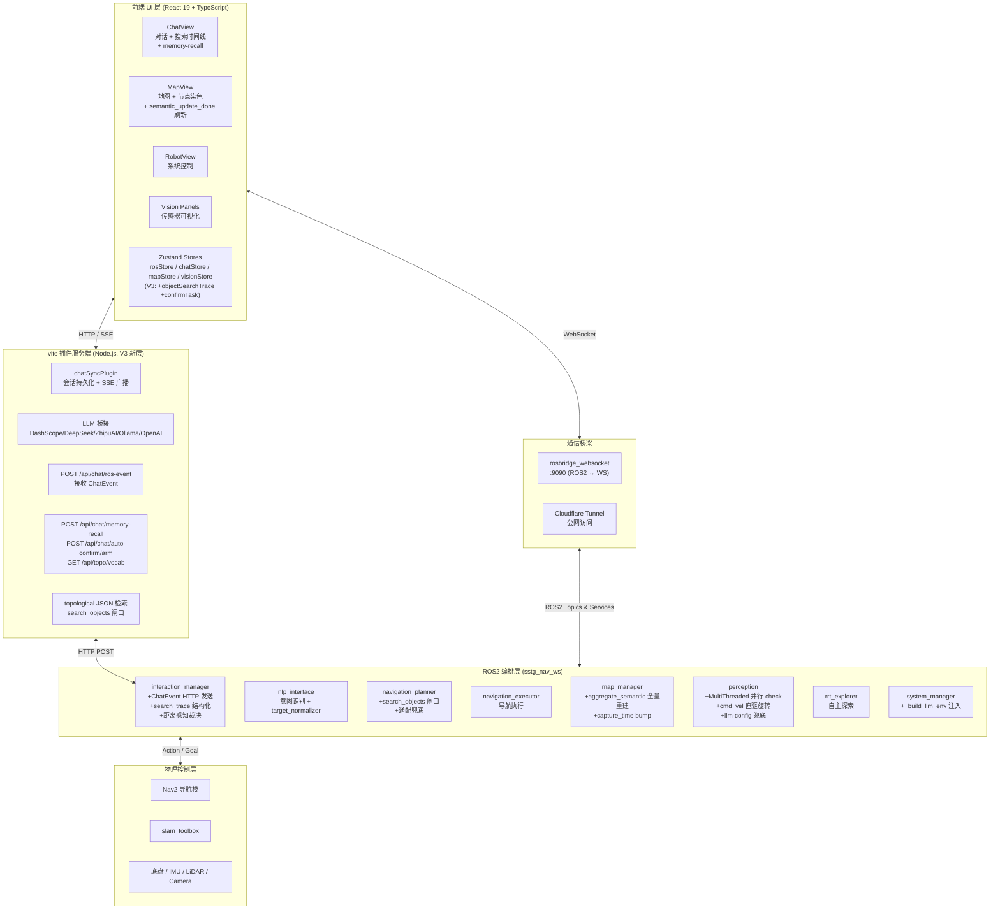
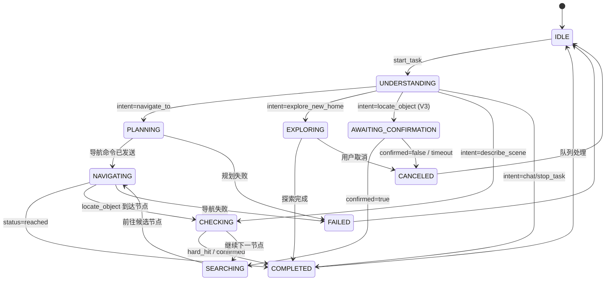
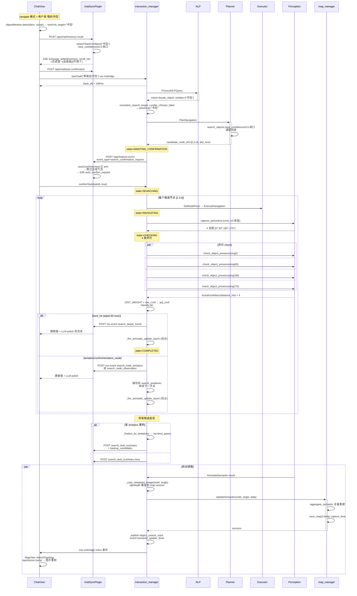

# SSTG V3 系统架构文档

> **版本**: V3.0
> **日期**: 2026-04-19
> **状态**: SSTG-V3 Production Ready
> **基线**: 承接 V2 的"文本级任务状态推送"，落地"结构化搜索追踪 + 聊天事件桥接 + 距离感知裁决 + 自修正地图"四大核心能力
> **文档定位**: SSTG 项目 V3 系统级架构全景文档，任何新开发者或 AI agent 读完本文即可理解整个项目

---

## 目录

- [1. 文档说明](#1-文档说明)
- [2. V3 相对 V2 的核心变化](#2-v3-相对-v2-的核心变化)
- [3. 系统架构总览](#3-系统架构总览)
- [4. ROS2 接口契约](#4-ros2-接口契约)
- [5. 核心编排引擎: interaction_manager](#5-核心编排引擎-interaction_manager)
- [6. 五大任务流程详解](#6-五大任务流程详解)
- [7. 前后端通信桥梁](#7-前后端通信桥梁)
- [8. 各模块技术细节](#8-各模块技术细节)
- [9. 搜索闭环：V3 的核心贡献](#9-搜索闭环v3-的核心贡献)
- [10. 自修正地图: 候选集对齐与节点刷新](#10-自修正地图-候选集对齐与节点刷新)
- [11. 部署与启动](#11-部署与启动)
- [附录 A: 关键文件路径速查表](#附录-a-关键文件路径速查表)
- [附录 B: 环境变量与配置参数](#附录-b-环境变量与配置参数)

---

## 1. 文档说明

### 1.1 定位与适用范围

本文档是 SSTG（Spatial Semantic Topological Graph）导航系统 V3 版本的系统级架构文档。V3 的核心目标是把 V2 的"文本级任务状态"升级为"结构化任务追踪 + 双消息聊天体验 + 距离感知搜索裁决 + 自修正拓扑地图"。

- **一文读懂全局**：覆盖 V3 新增的所有能力、接口、数据流
- **后续版本参考**：未来 V4/V5 扩展（例如多机协作、远程接管）可基于本文档提供的契约继续扩展
- **Agent 友好**：结构化组织，任何 AI agent 加载本文件即可获得完整 V3 上下文

### 1.2 与其他文档的关系

| 文档 | 定位 | 与本文档的关系 |
|------|------|----------------|
| `SSTG_V2_System_Architecture.md` | V2 系统架构 | 本文档承接其第 9 节 "V3 扩展分析"，将其全部落地 |
| `_WBT_WS_SSTG/doc/3.5_[ChatEvent]*.md` | V3 ChatEvent 设计 | 本文档 §4.1、§7.3 把它的接口落地 |
| `_WBT_WS_SSTG/doc/3.6_[SearchConfirmFix]*.md` | V3 搜索确认修复 | 本文档 §9 整合其所有修复点 |
| `_WBT_WS_SSTG/doc/3.7_[SelfCorrectingMap]*.md` | V3 自修正地图 | 本文档 §10 把它整合进全局视角 |
| `README.md` | 项目入口 | 本文档是其深度展开 |
| 各模块 `MODULE_GUIDE.md` | 单模块详解 | 本文档提供跨模块全局视角 |

### 1.3 V3 术语表（V2 基础上新增）

| 术语 | 说明 |
|------|------|
| ChatEvent | ROS→UI 的聊天事件桥接消息，承载搜索过程中"发给用户看"的结构化消息 |
| ObjectSearchTrace | 搜索任务的结构化追踪消息，驱动前端地图染色与时间线渲染 |
| Canonical Target | 经过 `target_normalizer` 归一化后的标准物体名（如"我的书包" → "书包"），在 planner / IM / chatSyncPlugin / VLM prompt 中保持一致 |
| DIST_WEIGHT | 距离感知置信度权重：`near=1.0 / mid=0.7 / far=0.35 / unknown=0.85` |
| Hard-Hit / Confirm / Tentative | 搜索裁决的三档 tier，分别对应"立即早退"/"确认命中"/"缓存到尾盘裁决" |
| Best-Guess | 所有候选走完后若无 hard-hit，挑 adj_conf 最高的 tentative 作"最佳猜测"兜底 |
| Polish Message | 前端在 ROS 硬数据消息后追加的 LLM 润色消息，使用 `meta.polishFor` 指向原消息 |
| Memory-Recall | 导航模式下用户提到物品时，前端合成"我记得见过 X，要不要去看看"气泡 + 历史图片 |
| Auto-Confirm Arm | 点"去看看"后前端预先授权；后端下一次 `search_confirmation_request` 自动接纳，无需二次点击 |
| Self-Correcting Map | 每次搜索命中节点都把最新 rgb/depth 图 + 语义 JSON 全量覆盖写回 map session，下次搜索直接消费新快照 |

---

## 2. V3 相对 V2 的核心变化

### 2.1 能力增量总览

| 能力 | V2 状态 | V3 状态 |
|------|---------|---------|
| 搜索过程可视化 | 只有文本 `TaskStatus` | 新增 `ObjectSearchTrace` 结构化 topic，地图可按节点染色，前端可渲染搜索时间线 |
| 搜索过程聊天 | 前端仅显示文本进度条 | 新增 `ChatEvent` HTTP 桥接，每个节点带 4 张图 + 命中说明 + 按钮 |
| VLM 并发 | 单线程，串行检查 4 张图 | `perception_node` 用 `MultiThreadedExecutor(num_threads=4)` + `ReentrantCallbackGroup`，4 张图 check 并行 |
| 语义回写 | 与搜索主链路串行 | `annotate_semantic` + `update_semantic` 异步 fire-and-forget，不阻塞搜索 |
| 置信度裁决 | raw_conf ≥ 0.5 即命中 | 距离权重 × raw_conf = adj_conf，四档 tier（hard_hit/confirm/tentative/tentative_weak），支持 best_guess 兜底 |
| 搜索确认 | 无，直接派机器人出发 | 新增 `AWAITING_CONFIRMATION` 状态 + `ConfirmTask.srv`；先展示历史图 + [去看看]/[不用了] 按钮 |
| 物体名规范化 | 前缀剥离散在 planner | 新增跨包 `target_normalizer`（字节一致），含中英同义词映射 |
| 旋转稳定性 | Nav2 spin BT，90° 常超时 | 改为 `/cmd_vel` + TF 闭环直驱（Round 4），默认 Kp=1.5, max_w=0.5 rad/s |
| 节点失败可见性 | 5 条 skip 路径全部静默 | 每条 skip 都 emit `search_node_observation`，文案说明原因 |
| 聊天消息体验 | 一条文本 | 双消息：ROS 硬数据 + LLM 后置润色（`meta.polishFor` 指针） |
| 导航模式触发记忆 | 必须敲"帮我找 X" | navigate 模式下提到物品词即触发 memory-recall 气泡 |
| 地图数据漂移 | 搜索不回写 map session | Round 8 每次搜索都 `_copy_viewpoint_image` 覆盖主图，`aggregate_semantic` 全量重建 |
| 候选集一致性 | 前端 searchTopoForObject vs 后端 planner 各自算 | Round 8 二者都按 `search_objects.best_confidence ≥ 0.6` 闸口过滤 |
| UI 实时刷新 | 节点图片需 F5 | `semantic_update_done` 事件 + 双 cache-buster (`?v=capture_time&t=topoNonce`) + `` 强制 remount |
| 消息排序 | 存在用户/机器人消息竞态 | `startTask` 前 `await addMessage(user)` 预创建用户消息 + `rosHandling` 标志避免 stream 双写 |
| 任务隔离 | 旧任务延迟事件串入新会话 | `activeTaskBySession` gate 硬丢弃 stale event |
| VLM API Key | 硬编码 + 启动脚本 env | 三层防御：ROS param → env → `~/sstg-data/chat/llm-config.json`；UI 运行时可热推 |

### 2.2 涉及文件总览（与 V2 diff）

**后端 ROS2（新增 / 大改）:**
- `sstg_msgs/msg/`: +`ChatEvent.msg` +`ObjectSearchTrace.msg` +`ViewpointData.msg`
- `sstg_msgs/srv/`: +`ConfirmTask.srv`
- `sstg_interaction_manager/`: +`target_normalizer.py` +`search_trace.py`；`interaction_manager_node.py` 从 ~1100 行扩到 2068 行
- `sstg_navigation_planner/`: +`target_normalizer.py`（与 IM 字节一致镜像）；`semantic_matcher.py` 加 `search_objects` 闸口 + 通配兜底
- `sstg_perception/`: +`search_trace.py`；`perception_node.py` 改 `MultiThreadedExecutor`；`panorama_capture.py` 新增 `/cmd_vel` + TF 闭环旋转
- `sstg_map_manager/`: `topological_node.py::aggregate_semantic` 改为"每次全量重建"
- `sstg_system_manager/`: `_build_llm_env` 从 llm-config.json 注入 Popen env

**前端（新增 / 大改）:**
- `sstg_ui_app/src/lib/objectMention.ts`（新）: navigate 模式 memory-recall 检测
- `sstg_ui_app/src/components/ChatView.tsx`: +auto-confirm arm + memory-recall 拦截 + action 按钮
- `sstg_ui_app/src/components/MapView.tsx`: +`semantic_update_done` 订阅 + 双 buster + ``
- `sstg_ui_app/src/store/rosStore.ts`: +`objectSearchTrace` 状态 + `confirmTask` + LLM 配置扇出 perception
- `sstg_ui_app/src/store/chatStore.ts`: +`message_removed` SSE 处理
- `sstg_ui_app/vite-plugins/chatSyncPlugin.ts`: +10 个新端点（见 §7.3）

---

## 3. 系统架构总览

### 3.1 四层架构（V3 从三层扩展到四层）

V3 在 V2 的"前端 UI / ROS2 编排 / 物理控制"三层中间，显式拉出**"vite 插件服务端"**作为第四层：它不只是 dev server，而是承载聊天持久化、LLM 调用、拓扑图片检索、memory-recall、auto-confirm、ROS 事件接收等 Node.js 服务端逻辑。



### 3.2 ROS2 包职责一览（保持 V2 的 10 个包，职责扩展）

| 包名 | 语言 | 核心节点 | V3 职责扩展 |
|------|------|----------|-----------|
| `sstg_msgs` | IDL | — | +`ChatEvent` +`ObjectSearchTrace` +`ViewpointData` +`ConfirmTask.srv` |
| `sstg_interaction_manager` | Python | `interaction_manager_node` | +HTTP 桥接 +结构化追踪 +距离裁决 +AWAITING_CONFIRMATION 状态 +`_copy_viewpoint_image` |
| `sstg_nlp_interface` | Python | `nlp_node` | +情感模板 +`/nlp/update_llm_config` 热推送 |
| `sstg_navigation_planner` | Python | `planning_node` | +`search_objects.best_confidence≥0.6` 闸口 +通配兜底 +`min_match_score 0.3→0.2` |
| `sstg_navigation_executor` | Python | `executor_node` | 基本无变化 |
| `sstg_map_manager` | Python | `map_manager_node` | `aggregate_semantic` 改全量重建；`topological_node.search_objects` 暴露 |
| `sstg_perception` | Python | `perception_node` | `MultiThreadedExecutor(4)` + `ReentrantCallbackGroup`；`/cmd_vel` 直驱旋转；llm-config 兜底 |
| `sstg_rrt_explorer` | C++/Python | `global/local_rrt_detector` | 基本无变化 |
| `sstg_system_manager` | Python | `system_manager_node` | `_build_llm_env` 注入 Popen env |

### 3.3 前端架构（V3 新增若干 store 字段 + 新库）

**技术栈**: React 19 + TypeScript + Vite + Zustand + Three.js + Tailwind CSS + roslib.js

**V3 新增文件**:
- `src/lib/objectMention.ts`: 物品词检测 + 词表 5s 缓存
- `src/components/MapView.tsx`: 新增 `topoNonce` + `semantic_update_done` 订阅 useEffect

**V3 新增 Store 字段**:
- `rosStore.objectSearchTrace: ObjectSearchTrace | null`
- `rosStore.confirmTask(taskId, confirmed)`: 调用 `/confirm_task` 服务
- `chatStore.ChatMessage.meta`: +`polishFor?: string` +`recallTarget?: string` +`actions?: ChatAction[]`

### 3.4 部署拓扑（与 V2 一致）

硬件平台：Yahboom X3 麦克纳姆轮全向底盘 + RPLidar S2 + Orbbec Gemini 330 + IMU
（硬件规格详见 `SSTG_Quick_Reference.md`）

公网访问通过 Cloudflare Tunnel 代理到 rosbridge `:9090` 和 Vite `:5173`。

---

## 4. ROS2 接口契约

### 4.1 消息类型（V3 共 13 个，V2 基础上 +3）

**V2 保留（10 个）**: `TaskStatus`, `NavigationFeedback`, `NavigationPlan`, `SemanticAnnotation`, `SemanticData`, `SemanticObject`, `GoalTraceEvent`, `Command`, `SystemStatus`, `PointArray`

**V3 新增（3 个）**:

**ChatEvent.msg** — ROS 聊天事件（HTTP POST 到 chatSyncPlugin）
```
std_msgs/Header header
string task_id
string session_id
string event_type       # search_confirmation_request / search_node_observation /
                        # search_node_tentative / search_target_found / search_task_summary
string role             # 固定为 'robot'
string text
int32 node_id
bool found
float32 confidence
string[] image_paths    # 格式固定为 "angle:absolute_path"，如 "90:/home/.../090deg_rgb.png"
string target_object
string source_phase
```
> **注意**: 虽然定义为 ROS msg，V3 实际通过 HTTP POST 传输（见 §7.3）。.msg 仅作为字段契约。

**ObjectSearchTrace.msg** — 结构化搜索追踪（驱动前端可视化）
```
std_msgs/Header header
string task_id
string target_object
string phase               # planning / navigating / capturing / checking / updating / completed
string event_type          # plan_ready / navigate_start / node_skip / capture_ready /
                           # check_aggregate / node_miss / found / completed_not_found /
                           # semantic_update_done
string message
int32 current_node_id
int32[] candidate_node_ids
int32[] visited_node_ids
int32[] failed_node_ids
int32 current_candidate_index
int32 total_candidates
int32 current_image_index
int32 total_images
int32 current_angle_deg
string current_image_path
bool found
float32 confidence
string evidence_image_path
```

**ViewpointData.msg** — 单视角语义数据
```
int32 angle
string image_path
sstg_msgs/SemanticData semantic_data
float64 capture_time
```

### 4.2 服务接口（V3 共 18 srv，V2 基础上 +1）

V2 已有的 17 个服务全部保留。V3 新增：

**ConfirmTask.srv** — 搜索确认
```
string task_id
bool confirmed      # true = 去看看 / false = 不用了
---
bool success
string message
```

V3 新增的服务提供者：
- `/confirm_task` — 由 interaction_manager 提供
- `/perception/update_llm_config` — 由 perception_node 提供（镜像 `/nlp/update_llm_config`）

### 4.3 Topic 清单（V3 新增 1 个）

V2 全部保留。V3 新增：

| Topic | 消息类型 | 发布者 | 订阅者 | 频率 | 用途 |
|-------|----------|--------|--------|------|------|
| `/object_search_trace` | ObjectSearchTrace | interaction_manager | rosStore, MapView | 事件驱动 | 搜索状态结构化追踪，驱动地图节点染色与 UI 实时刷新 |

### 4.4 动作接口（V3 保留 V2 的 1 个）

`ExploreHome.action` 不变。

### 4.5 HTTP 接口（V3 新增，vite 插件层）

这是 V3 引入的"第二套契约"，通过 chatSyncPlugin 暴露。完整清单见 §7.3。

核心新增：
- `POST /api/chat/ros-event` — 接收 ROS 侧的 ChatEvent
- `POST /api/chat/memory-recall` — navigate 模式物品触发记忆召回
- `POST /api/chat/auto-confirm/arm` — 为下一个 confirmation 事件预授权
- `GET  /api/topo/vocab` — 返回已知物品词表（5s 缓存）
- `POST /api/chat/ros-task/abandon` — 取消搜索任务（任务隔离）

---

## 5. 核心编排引擎: interaction_manager

> **文件**: `sstg_nav_ws/src/sstg_interaction_manager/sstg_interaction_manager/interaction_manager_node.py` (2068 行，V2 为 ~1100 行)
> **节点名**: `interaction_manager_node`
> **V3 角色**: 任务编排 + **搜索状态机裁决 + ChatEvent 桥接 + 结构化追踪发布 + Viewpoint 刷新**

### 5.1 TaskState 状态机（V3 新增 AWAITING_CONFIRMATION）



**11 个状态**（V3 新增 `AWAITING_CONFIRMATION`）:

| 状态 | 值 | 含义 |
|------|-----|------|
| IDLE | `idle` | 空闲 |
| UNDERSTANDING | `understanding` | NLP 理解中 |
| PLANNING | `planning` | 规划路径 |
| NAVIGATING | `navigating` | 导航中 |
| EXPLORING | `exploring` | RRT 探索 |
| SEARCHING | `searching` | 逐节点搜索 |
| CHECKING | `checking` | VLM 检查 |
| **AWAITING_CONFIRMATION** | `awaiting_confirmation` | **V3 新增**：等待用户点"去看看"/"不用了" |
| COMPLETED | `completed` | 任务完成 |
| FAILED | `failed` | 失败 |
| CANCELED | `canceled` | 取消 |

### 5.2 V3 新增的 Publisher / Service / Client

**Publisher**（在 `__init__` line 121-122）:
```python
self.task_status_pub = self.create_publisher(TaskStatus, 'task_status', 10)
self.search_trace_pub = self.create_publisher(ObjectSearchTrace, 'object_search_trace', 10)  # V3
```

**Service Server**（新增 `/confirm_task`，line 134-136）:
```python
self.create_service(
    ConfirmTask, 'confirm_task',
    self._confirm_task_callback, callback_group=self.cb_group)
```

**Service Client**（V3 新增两个，line 165-168）:
```python
self.annotate_client = self.create_client(AnnotateSemantic, 'annotate_semantic', ...)
self.update_semantic_client = self.create_client(UpdateSemantic, 'update_semantic', ...)
```

### 5.3 搜索裁决核心：距离权重 + tentative 累积

V3 在顶部定义的关键常量（line 60-65）：

```python
DIST_WEIGHT = {'near': 1.0, 'mid': 0.7, 'far': 0.35, 'unknown': 0.85}
HARD_HIT_ADJ = 0.85       # 加权后 ≥0.85 且 near → 立即 early-exit
TENTATIVE_MIN_ADJ = 0.40  # 历史遗留；Round 6+ 已放宽为"任意 tentative 都可作 best_guess"
MIN_RAW_CONF = 0.5        # VLM 原始 conf 下限
```

裁决矩阵（`_classify_tier` + `_on_all_checks_done`）:

| raw_conf | dist_hint | adj_conf | tier | 动作 |
|---|---|---|---|---|
| ≥0.85 | near | ≥0.85 | **hard_hit** | `_finalize_found(via='hard_hit')`，同时 fire annotate/update，早退 |
| ≥0.5 | near | 0.5-0.85 | **confirm** | 缓存到 `search_tentatives`，继续下一节点 |
| ≥0.5 | mid | 0.35-0.63 | **tentative** | 缓存 |
| ≥0.5 | far | 0.18-0.33 | **tentative_weak** | 缓存 |
| ≥0.5 | unknown | 0.43-0.85 | **tentative_unknown** | 缓存 |
| <0.5 | * | — | reject | 该张图不算 hit |

全部走完后 `_finalize_by_tentatives`:
1. 有 confirm → 挑 adj_conf 最大 → `_finalize_found(via='confirmed')`
2. 无 confirm 但有任何 tentative → 挑 adj_conf 最大 → `_finalize_found(via='best_guess')`（仅供参考）
3. 全空 → `search_task_summary` + COMPLETED

### 5.4 结构化追踪发布（`_publish_search_trace`）

与 `_publish_status` 并行的第二条数据通道（line 251-273）：

```python
def _publish_search_trace(self, phase: str, event_type: str, message: str, **kwargs):
    msg = ObjectSearchTrace()
    msg.task_id = self.current_task_id
    msg.target_object = self.search_target
    msg.phase = phase
    msg.event_type = event_type
    msg.candidate_node_ids = list(self.search_candidates)
    msg.visited_node_ids = list(self.search_visited_nodes)
    msg.failed_node_ids = list(self.search_failed_nodes)
    msg.current_candidate_index = self.search_index
    # ... 其余 15+ 字段
    self.search_trace_pub.publish(msg)
```

**发布时机**（7 个关键点）:
- `plan_ready`: planner 返回候选后
- `navigate_start`: 每个节点导航启动
- `node_skip`: 5 条 skip 路径每一条
- `capture_ready`: 全景拍摄完成
- `check_aggregate`: 所有 check 汇总后
- `found` / `node_miss` / `completed_not_found`: 搜索尾盘
- `semantic_update_done`: 每个 viewpoint 的 update_semantic 成功后（触发 UI 刷新）

### 5.5 ChatEvent HTTP 桥接（`_post_chat_event`）

V3 用 Python 标准库 `urllib` 避免引入第三方依赖，timeout=5s，fire-and-forget（line 279-314）：

```python
def _post_chat_event(self, event_data: dict):
    url = f'http://localhost:{self._chat_api_port}/api/chat/ros-event'
    body = json.dumps(event_data, ensure_ascii=False).encode('utf-8')
    req = urllib.request.Request(url, data=body,
        headers={'Content-Type': 'application/json'})
    with urllib.request.urlopen(req, timeout=5) as resp:
        # 失败仅 warn，不阻塞搜索
        ...
```

### 5.6 线程模型（保持 V2）

- Executor: `MultiThreadedExecutor(num_threads=4)`
- Callback Group: `ReentrantCallbackGroup` 全局
- 线程安全: `threading.Lock` 保护 `task_state` / `search_tentatives` / `_check_pending` 等共享状态
- Watchdog: 30s 警告 / 60s 超时（`AWAITING_CONFIRMATION` 状态豁免 watchdog）

---

## 6. 五大任务流程详解

V2 是"四大流程"，V3 新增 `locate_object` 的确认前置流程，升级为五大流程。

### 6.1 navigate_to（保持 V2）

状态转换: `IDLE → UNDERSTANDING → PLANNING → NAVIGATING → COMPLETED`
涉及服务: `ProcessNLPQuery → PlanNavigation → GetNodePose → ExecuteNavigation`

### 6.2 explore_new_home（保持 V2）

状态转换: `IDLE → UNDERSTANDING → EXPLORING → COMPLETED`
涉及接口: `ExploreHome` Action

### 6.3 locate_object（V3 全面改造）

见 §9 完整专述。

### 6.4 describe_scene（保持 V2）

NLP → Perception 拍照 + VLM 描述。

### 6.5 chat（V3 微调）

V3 chat 流程与 V2 一致，但前端在 navigate 模式下会先经过 `objectMention.detectObjectMention` 拦截（见 §9.2）。

---

## 7. 前后端通信桥梁

### 7.1 通信通道总览（V3 从"一条"变"三条"）

| 通道 | 协议 | 用途 | V 版本 |
|------|------|------|--------|
| rosbridge WebSocket | WS `:9090` | ROS Topic 订阅 + Service 调用 | V1+ |
| SSE 聊天流 | HTTP SSE `/api/chat/events` | 聊天消息实时推送 | V2+ |
| **ROS → chatSyncPlugin HTTP** | HTTP POST `/api/chat/ros-event` | interaction_manager 向前端聊天桥发送 ChatEvent | **V3 新增** |

### 7.2 Topic 订阅映射（V3 新增 1 条）

| ROS2 Topic | Store 字段 | 使用组件 | 说明 |
|------------|------------|----------|------|
| `/navigation_feedback` | `rosStore.robotPose` | MapView | V2 保留 |
| `/task_status` | `rosStore.taskStatus` | ChatView, MapView | V2 保留 |
| `/system/status` | `rosStore.systemStatus` | RobotView | V2 保留 |
| `/system/log` | `rosStore.systemLogs` | RobotView | V2 保留 |
| `/map` | `rosStore.occupancyGrid` | MapView | V2 保留 |
| **`/object_search_trace`** | **`rosStore.objectSearchTrace`** | **MapView, ChatView** | **V3 新增** |

### 7.3 chatSyncPlugin 端点清单（V3 完整列表）

`sstg_ui_app/vite-plugins/chatSyncPlugin.ts` 共 2226 行，暴露下列 HTTP / SSE 端点：

**会话与消息（V2 保留）**:
- `GET/POST/DELETE /api/chat/sessions` — 会话 CRUD
- `PUT /api/chat/sessions/active` — 切换当前会话
- `POST /api/chat/sessions/:id/messages` — 追加消息
- `PUT /api/chat/messages/:id` — 更新消息
- `GET /api/chat/events` — SSE 事件流
- `GET/PUT /api/llm-config` — LLM 配置
- `POST /api/chat/stream` — LLM 流式回复

**图片与拓扑（V3 扩展）**:
- `GET /api/images/*` — 聊天附件图片
- `GET /api/images/ros-events/:sessionId/:taskId/:filename` — ROS 事件图片副本
- `GET /api/topo/search-images` — 按物体查历史图片
- **`GET /api/topo/vocab`** — **V3**：已知物品词表（5s TTL 缓存）

**V3 新增：ROS 桥接**:
- **`POST /api/chat/ros-event`** — 接收 ROS ChatEvent，复制图片到 `~/sstg-data/chat/images/ros-events/{sessionId}/{taskId}/`，组装 ChatMessage，SSE 广播
- **`POST /api/chat/ros-task/abandon`** — 取消任务，清空 activeTaskBySession

**V3 新增：Memory Recall / Auto-Confirm**:
- **`POST /api/chat/memory-recall`** `{sessionId, target}` — navigate 模式物品触发，合成 memory_recall_hit/miss 气泡
- **`POST /api/chat/auto-confirm/arm`** `{sessionId}` — 预授权下一次 `search_confirmation_request` 自动接纳

### 7.4 SSE 事件类型（V3 新增）

基础事件（V2）: `message_added`, `message_updated`, `session_created`, `session_switched`, `session_deleted`, `session_renamed`, `llm_config_updated`

V3 新增:
- `message_removed` — LLM polish 失败时删除占位气泡，避免闪烁
- `auto_confirm_request` — 通知前端自动调用 `confirmTask(taskId, true)`

### 7.5 LLM 润色双消息机制（V3 核心创新）

**背景**: ROS 端输出"官方具体直接"的硬数据文案（如"节点 3：180° 方向疑似书包，置信度 32%，远距离"），前端追加 LLM 润色版（如"节点 3 远处有点像书包，但离得远不敢拍板，我再去别的位置看看~"）。

**关键约束**: 不得替换原消息，否则 UI 会"抖"。

**实现**（chatSyncPlugin.ts）:
1. ROS 的 ChatEvent 到达 `/api/chat/ros-event` → 写入硬数据消息 → SSE 广播
2. 立即追加一条 `content=''，meta.status='polishing'，meta.polishFor=<原消息 id>` 的空占位
3. 异步调 LLM（timeout=12s, max_tokens=200, temperature=0.5）填充 content
4. LLM 失败 → 广播 `message_removed` 删除占位

**LLM System Prompt 5 条硬约束**:
1. 不得改动或编造数字（节点/角度/百分比保留）
2. 不得增加未提及的位置/物体
3. 2 句以内，禁 markdown/列表/emoji
4. 第一人称"我"，不自称 AI/助手
5. 像熟悉空间的好伙伴，可带语气词但不卖萌

### 7.6 完整数据流向图（V3）

```
┌─────────────────────────────────────────────────────────┐
│                     前端 (React)                         │
│  ChatView ◄── chatStore ◄── rosStore.taskStatus          │
│  MapView  ◄── rosStore.robotPose + occupancyGrid         │
│                + objectSearchTrace (V3)                  │
│                                                          │
│  navigate 模式：用户发消息                                │
│     ↓                                                    │
│   objectMention.detect(text, vocab)  (V3)                │
│     ├ hit  → /api/chat/memory-recall                     │
│     ├ miss → 同上 miss 分支                              │
│     └ none → /api/chat/stream (LLM)                      │
│                                                          │
│  点击 [去看看]：                                          │
│     /api/chat/auto-confirm/arm  (V3)                     │
│       → startTask("帮我找X") (rosbridge)                 │
│                                                          │
│  点击 [帮我找一找]：                                      │
│       → startTask("帮我在所有节点找X") (rosbridge)        │
└─────────────────────────────────────────────────────────┘
         ▲                              ▲
         │ SSE: message_added/           │ WebSocket
         │ message_removed/              │ rosbridge :9090
         │ auto_confirm_request (V3)     │
         │                               │
┌────────┴────────────────┐   ┌──────────┴────────────────┐
│  chatSyncPlugin (V3)    │   │  ROS2 (interaction_manager)│
│                         │   │                           │
│  /api/chat/ros-event ◄──┼───┤  _post_chat_event HTTP    │
│    ├ 图片复制到        │   │                           │
│    │ ~/sstg-data/.../  │   │  publish /object_search_   │
│    ├ 追加硬数据消息    │   │    trace (V3)              │
│    ├ SSE 广播          │   │                           │
│    └ LLM polish 追加   │   │  provide /confirm_task srv │
│                         │   │                           │
│  /api/chat/memory-recall│   │  call _copy_viewpoint_    │
│    读 topo JSON         │   │    image → map session    │
│    search_objects 闸口  │   │  annotate_semantic async  │
└─────────────────────────┘   │  update_semantic async    │
                              └───────────────────────────┘
```

---

## 8. 各模块技术细节

### 8.1 sstg_nlp_interface（V3 微调）

V3 改动:
- System prompt 新增"情感样例"节（帮找东西 / 圈出来 / 发图）
- 提供 `/nlp/update_llm_config` 热推送服务（V2 已有）
- NLP 实体提取加入"动词/功能词过滤集"（找/看/帮/拿 40+词）+ 正则兜底（"找XX"/"XX 在哪"）

### 8.2 sstg_navigation_planner（V3 大改）

**`planning_node.py`**:
- 使用 `target_normalizer.normalize_search_target`（line 242 附近）替代内联前缀剥离
- `min_match_score` 0.3 → 0.2（让更多候选存活，配合通配兜底）
- Plan 结果塞入 `candidate_details`（含 `distance_hint`）传给 IM

**`semantic_matcher.py`**:
- `CANDIDATE_MIN_CONF = 0.6` 常量
- `_match_object` 只读 `search_objects` 权威源 + `best_confidence ≥ 0.6` 过滤（移除 semantic_tags 子串兜底）
- `_generate_candidates` 开头加通配分支 `entity in ('*', '')` → 全节点 append
- 尾部兜底：按白名单过滤后若为 0，全节点作 candidates 返回
- `_calculate_match_score` 对 `entity in ('*', 'default', '')` → return 0.5

**`target_normalizer.py`**（新，与 IM 字节一致）:
- 前缀: `['找我的','帮我找','到我的','给我找','我的','找','到','帮','给']`（贪婪最长）
- 后缀: `['在哪里','在哪','的位置','去哪了','的图']`
- 尾部停用字: `{'的','了','吗','呢','吧','在'}`
- 中英同义词表: 50+ 项（`'backpack' → '书包'`, `'chair' → '椅子'` 等）
- `prefer_chinese_label(target, original_text)`: NLP 返英文但用户说中文 → 映射回中文 canonical

### 8.3 sstg_navigation_executor（保持 V2）

基本无变化。

### 8.4 sstg_map_manager（V3 改动）

**`topological_node.py::aggregate_semantic`**:
- V2: 跨次 merge，累积历史观测
- V3: **每次全量重建** `search_objects`。`aggregate_semantic` 开头 `self.search_objects = {}`，按当前 viewpoints 完全重算
- 理由: "自修正" 语义——上次写过的条目不能在本次残留；让被遮挡物品下次搜不到是接受的权衡

**`topological_map.py`**:
- `save_map()` 支持序列化 `search_objects` / `viewpoints` / `capture_time`

**`config/map_config.yaml`**:
- `active_map: lab_20260402`（默认）
- IM 和 chatSyncPlugin 均从此配置派生 session 路径

### 8.5 sstg_perception（V3 大改）

**`perception_node.py`**:
- **并发改造**: `MultiThreadedExecutor(num_threads=4)`；`ReentrantCallbackGroup` 赋给 `check_object_presence` 和 `annotate_semantic`；`capture_panorama` 保持 `MutuallyExclusive`（相机资源互斥）
- **LLM 配置三层防御**: `param → env → ~/sstg-data/chat/llm-config.json`；启动日志 `[SEARCH-TRACE] perception.boot vlm_client=OK key_source=... provider=... model=...`
- **cmd_vel 直驱**: 新建 `geometry_msgs/Twist` publisher，注入 `PanoramaCapture`
- **`_check_object_presence_callback`**: 新增 chain-of-thought grounding prompt（强制 `visible_objects` 数组 + 禁基于推测给 found=true）+ 每阶段 trace 日志（enter / reject / vlm_fail / result / exception）

**`panorama_capture.py`**:
- `_rotate_to_angle` 改 dispatcher，默认走 `_rotate_with_cmd_vel`（TF 闭环），失败 fallback 到 `_rotate_with_nav2_spin`
- `_rotate_with_cmd_vel`: 20Hz 循环，`w = sign(err) * min(|err|*Kp, max_w)`，`|err|<tol` 发零速度 + sleep 0.2s 稳定
- 默认参数: `Kp=1.5, max_w=0.5 rad/s, tol=2°, timeout=8s`（Round 5 从 3s 调至 8s，消除 90° retry 循环）
- 单角度失败不再整体 return（Phase G skip-continue），记入 `failed_angles` 后 `continue`
- 结构化 log: `panorama.start_yaw / rotate.cmd_vel.step/done/timeout / panorama.partial / panorama.all_failed`

### 8.6 sstg_rrt_explorer（保持 V2）

基本无变化。

### 8.7 sstg_system_manager（V3 改动）

**`_build_llm_env(base_env)`**（新增）:
- 读取 `~/sstg-data/chat/llm-config.json`
- 组装通用变量: `SSTG_LLM_PROVIDER/API_KEY/BASE_URL/MODEL`
- 组装 provider 专用: `DASHSCOPE_API_KEY`, `OPENAI_API_KEY`, `DEEPSEEK_API_KEY`, `ZHIPUAI_API_KEY`, `OLLAMA_API_KEY`
- `_start_mode` 和 `_restart_node_callback` 的 Popen 均加 `env=_build_llm_env(os.environ)`

---

## 9. 搜索闭环：V3 的核心贡献

这是 V3 最重要的改动。把 `locate_object` 从"用户敲命令→后端直接派机器人出发"升级为"记忆召回 → 确认 → 并行 check → 距离裁决 → 双消息反馈 → 后台回写"的完整闭环。

### 9.1 端到端时序图



### 9.2 Memory Recall（前端触发路径）

**`sstg_ui_app/src/lib/objectMention.ts`** 核心逻辑:

```typescript
detectObjectMention(text, vocab) →
  { kind: 'hit',  target }   // 词表最长子串命中
  { kind: 'miss', target }   // 正则抽出候选但词表无命中
  { kind: 'none' }            // 无物品语义

正则集合:
  /我的(.{2,6}?)(?:[在呢吗$])/
  /(.{2,6}?)(?:在哪里?|放哪了?|去哪了?)/
  /(?:看到|记得).{0,3}?(.{2,6}?)(?:吗[？?]?$|[了$])/

停词过滤: {东西,什么,地方,时候,记忆,印象,哪里,房间...}
```

**`chatSyncPlugin.ts::buildKnownObjectVocab`** 聚合词典源:
- `node.search_objects` 的 key + `meta.name/name_cn`
- `viewpoints[*].semantic_info.objects[*].name/name_cn`
- 5s TTL + mtime 签名缓存

**拦截点**: `ChatView.tsx::handleSend` 在 "有图片→stream" 之后、"走 ROS" 之前:

```typescript
if (chatMode === 'navigate' && text) {
  const memRes = detectObjectMention(text, vocab);
  if (memRes.kind === 'hit' || memRes.kind === 'miss') {
    await addMessage(user);
    await fetch('/api/chat/memory-recall', {...});
    return;  // 不走 LLM stream，不走 ROS
  }
}
```

### 9.3 搜索确认（AWAITING_CONFIRMATION 状态）

**后端**（interaction_manager）:
1. Planner 返回候选后，不直接导航，先 emit `ChatEvent event_type=search_confirmation_request`
2. `_set_state(AWAITING_CONFIRMATION)`，watchdog 豁免
3. 等待前端调用 `/confirm_task` service

**前端**（chatSyncPlugin）:
1. 若 session 已 `armAutoConfirm`（用户从 memory-recall 气泡点过"去看看"）→ 跳过合成气泡，SSE 广播 `auto_confirm_request`
2. 否则合成"我记得在 X、Y 见过 {target}...[去看看]/[不用了]"气泡

**前端**（chatStore）:
- SSE `auto_confirm_request` case → 自动调 `useRosStore.confirmTask(taskId, true)`

### 9.4 并行 check_object_presence

`perception_node` 并发改造前每个节点 4 张图串行 ~12-32s。V3 并行后 ~3-8s/节点。

关键 code path（`interaction_manager_node.py`）:

```
_on_search_capture_done
  → _check_all_images_parallel()      # 同时发 4 个 call_async
    → 4 × _on_parallel_check_done(future, image_index)
      → with _lock:
           _check_results[i] = result
           _check_pending -= 1
      → if _check_pending == 0: _on_all_checks_done()
```

并发安全要点:
- `_check_results[i]` 每个 callback 只写自己 index 无竞争
- `_check_pending` 在 `_lock` 保护下递减判零
- `_on_all_checks_done` 只会触发一次（最后一个 callback）
- 取消场景: 每个 callback 入口检查 `_get_state() == CANCELED`

### 9.5 距离感知 VLM Prompt

`perception_node.py::_check_object_presence_callback` 的 prompt（V3 Round 6 扩展）：

```
请仔细观察图片，判断是否有"{target}"。
以 JSON 回复：
{"found": true/false, "confidence": 0.0-1.0, "description": "...",
 "distance_hint": "near|mid|far", "visible_objects": ["...", ...]}

距离判定：near=<3m, mid=3-8m, far=>8m 或目标占画面<5%
宁漏不误：误报会让机器人白跑。found=true 时必须在 description 写位置细节
(如"画面右下角")；说不出位置则改 false。
只回复 JSON。
```

`distance_hint` 通过在 `description` 前加 `[dist=near|mid|far|unknown]` 标签传回 IM，避免改 srv。

### 9.6 节点 skip 可见性（5 条路径）

V2 的 5 条 skip 路径全部静默跳过，用户看不到。V3 每条都 emit `search_node_observation` 带 skip_reason:

| 路径 | reason 文案 |
|---|---|
| `_on_search_pose_done` 异常 | "位姿获取失败" |
| `_on_search_pose_done` result fail | "位姿获取失败" |
| `_on_search_exec_done` fail | "导航执行未成功" |
| `_on_search_capture_done` 异常 | "拍照异常" |
| `_on_search_capture_done` 空图 | "未拿到可用的现场图片" |

### 9.7 任务隔离与取消

**`activeTaskBySession: Map<sessionId, taskId>`**（chatSyncPlugin）:
- `search_confirmation_request` 时登记 active task
- `STALE_GATED_TYPES = {search_node_observation, search_node_tentative, search_target_found, search_task_summary}`
- 收到事件时对比 active，不匹配 → 硬丢弃 + `console.warn`
- `/api/chat/ros-task/abandon` 清空该 session 的 active

防止连续两次搜索时旧任务延迟事件串入新会话。

---

## 10. 自修正地图: 候选集对齐与节点刷新

> 对应 3.7 文档 Round 8 全部内容。

### 10.1 问题本源

V2 遗留的"两套记忆"分裂:

```
记忆 A (前端): searchTopoForObject
  读 viewpoints[angle].semantic_info.objects[]
  用 TS scoreObjectMatch 匹配
  ↓ 气泡 "在节点 {X,Y} 见过"

记忆 B (后端): planner _match_object
  读 semantic_tags + search_objects
  用 Python OBJECT_TYPE_MAPPING 匹配
  ↓ candidate_node_ids
```

两条独立管线读不同字段、用不同算法、不共享结果 → bubble 说 {2,3,4}、planner 却走 {4,0}。

### 10.2 V3 Round 8 的对齐策略

**统一闸口**: 两侧都用 `search_objects.best_confidence ≥ 0.6`

**后端** `semantic_matcher.py::_match_object`:
```python
for node_id, node_info in topological_nodes.items():
    search_objects = node_info.get('search_objects', {}) or {}
    for key, meta in search_objects.items():
        best_conf = float(meta.get('best_confidence', 0.0) or 0.0)
        if best_conf < CANDIDATE_MIN_CONF:  # 0.6
            continue
        if any(self._is_object_match(entity_lower, (n or '').lower())
               for n in [key, meta.get('name',''), meta.get('name_cn','')] if n):
            matches.append((node_id, node_info))
            break
```

**前端** `chatSyncPlugin.ts::searchTopoForObject`:
```typescript
const searchObjects = node.search_objects || {};
let passConfGate = false;
for (const [k, meta] of Object.entries(searchObjects)) {
  const bestConf = Number(meta?.best_confidence) || 0;
  if (bestConf < 0.6) continue;
  const names = [k, meta?.name||'', meta?.name_cn||''].map(n=>n.toLowerCase());
  if (names.some(n => n && (n===query || n.includes(query) || query.includes(n)))) {
    passConfGate = true;
  }
}
if (!passConfGate) continue;  // 整节点跳过，不走 viewpoint 兜底
```

### 10.3 Viewpoint 全量刷新

**`interaction_manager_node.py::_copy_viewpoint_image`**（line 1967-2028 附近）:

```python
def _copy_viewpoint_image(self, node_id, angle):
    # 源: self.search_raw_image_entries ("angle:abs_path")
    # 目的: {session_dir}/captured_nodes/node_{node_id}/{angle:03d}deg_{rgb,depth}.png
    src_rgb = ...  # panorama_capture 产出
    src_depth = src_rgb.replace('_rgb.', '_depth.')
    dst_dir = os.path.join(session_dir, 'captured_nodes', f'node_{node_id}')
    os.makedirs(dst_dir, exist_ok=True)
    shutil.copy2(src_rgb, os.path.join(dst_dir, f'{angle:03d}deg_rgb.png'))
    shutil.copy2(src_depth, os.path.join(dst_dir, f'{angle:03d}deg_depth.png'))
    self._trace(f'[SEARCH-TRACE] copy.image.ok node={node_id} angle={angle} ...')
```

调用时机: `_on_bg_annotate_done` 里 `UpdateSemantic` 之前（hard_hit 和 tentative 路径都会走）。

### 10.4 aggregate_semantic 全量重建

**`topological_node.py::aggregate_semantic`**（line 271-355）:

```python
def aggregate_semantic(self, strategy='union'):
    self.search_objects = {}  # 关键: 每次全清空
    infos = [vp.semantic_info for vp in self.viewpoints.values() if vp.semantic_info]
    if not infos:
        return
    # 单 viewpoint 和 multi-viewpoint 都走全量重建
    for angle, vp in self.viewpoints.items():
        for obj in vp.semantic_info.objects:
            key = (obj.name_cn or obj.name or '').lower()
            # 更新 best_confidence = max across viewpoints
            # 更新 supporting_angles, best_view_score
    for key in best_meta:
        self.search_objects[key] = {
            'best_confidence': best_confidence[key],
            'supporting_angles': sorted(obj_angles[key]),
            'name': ..., 'name_cn': ..., ...
        }
```

V2 为 cross-run merge（累积历史）→ V3 为全量重建（只信此刻）。代价是被遮挡物品下次搜不到，接受。

### 10.5 UI 实时刷新（三层防御）

**问题**: 后端写盘后，UI 面板里的 `` URL 字符串不变 → React 不重渲染 → 浏览器缓存 → 破图。

**V3 方案**（`MapView.tsx` + `vite.config.ts`）:

**Layer 1 — 中间件剥查询串**:
```typescript
// vite.config.ts mapSessionsPlugin
server.middlewares.use('/map-sessions', (req, res, next) => {
  const cleanUrl = req.url.split('?')[0];  // 关键: 剥 ?v=... &t=...
  const filePath = path.join(MAPS_ROOT, decodeURIComponent(cleanUrl));
  // ...
  res.setHeader('Cache-Control', 'no-cache, must-revalidate');
  res.setHeader('Pragma', 'no-cache');
  fs.createReadStream(filePath).pipe(res);
});
```

**Layer 2 — 双 cache-buster URL**:
```typescript
// MapView.tsx getNodeImageUrl
const ct = Math.floor(Number(vp.capture_time)) || 0;
const url = `/map-sessions/.../${angle:03d}deg_rgb.png?v=${ct}&t=${topoNonce}`;
// v=capture_time: 后端写盘时 bump
// t=topoNonce: 前端 refetchTopology 时 bump
```

**Layer 3 — `` 强制 remount**:
```typescript

```

**触发点**（V3 新增 useEffect）:
```typescript
// MapView.tsx
useEffect(() => {
  if (objectSearchTrace?.eventType === 'semantic_update_done') {
    // debounce 400ms
    const timer = setTimeout(() => refetchTopology(), 400);
    return () => clearTimeout(timer);
  }
}, [objectSearchTrace?.eventType, objectSearchTrace?.currentNodeId,
    objectSearchTrace?.currentAngleDeg]);  // 加 angle 避免 dep 去重
```

兜底: `taskStatus.state in (completed/failed/cancelled)` 后 800ms 再拉一次。

### 10.6 selectedNode 派生避免 stale

```typescript
// V2: 独立 useState<TopoNode | null>(node3) — topoNodes 刷新后仍持有旧对象
// V3: 派生自 topoNodes
const [selectedNodeId, setSelectedNodeId] = useState<number | null>(null);
const selectedNode = useMemo(
  () => selectedNodeId == null ? null : topoNodes.find(n => n.id === selectedNodeId) ?? null,
  [topoNodes, selectedNodeId]
);
```

### 10.7 hard_hit 不再绕过副作用链（Round 8+++）

V3 早期 bug: `hard_hit` 分支 `_finalize_found` 后直接 `return`，跳过 `_fire_annotate_update_async`，导致命中节点的 session 图/JSON 从未刷新。

V3 修复: `hard_hit` 分支在 `_finalize_found` 之前先触发副作用链:
```python
if tier == 'hard_hit':
    self._fire_annotate_update_async(node_id, images)  # 关键
    self._finalize_found(tentative, via='hard_hit', ...)
    return
# tentative/confirm/tentative_weak 继续 fallthrough 到统一的 _fire_annotate_update_async
```

---

## 11. 部署与启动

### 11.1 三阶段部署流程（与 V2 一致）

**Phase 1: RRT 探索建图**
```bash
ros2 launch sstg_rrt_explorer rrt_exploration_full.launch.py
```

**Phase 2: 拓扑语义采集**
```bash
ros2 launch sstg_rrt_explorer navigation_full.launch.py
```

**Phase 3: 生产导航（V3 全栈）**
```bash
ros2 launch sstg_interaction_manager sstg_full.launch.py
```

### 11.2 V3 启动时序（sstg_full.launch.py）

基本保持 V2 顺序，但额外要求 Vite dev server 就绪（端口 5173）后 IM 的 HTTP POST 才能落地：

| 时间 | 节点 | V3 备注 |
|------|------|---------|
| T=0s | rosbridge_websocket :9090 | 不变 |
| T=0s | map_manager_node | V3: 读 `config/map_config.yaml::active_map` |
| T=0s | system_manager_node | V3: `_build_llm_env` 启用 |
| T=2s | nlp_node | V3: llm-config 兜底 |
| T=2s | planning_node | V3: search_objects 闸口 + 通配兜底 |
| T=2s | executor_node | 不变 |
| T=2s | perception_node | V3: `MultiThreadedExecutor(4)` + cmd_vel publisher |
| T=2s | exploration_action_server | 不变 |
| T=2s | webrtc_camera_bridge | 不变 |
| T=5s | interaction_manager_node | V3: 读 maps_root/active_map 参数 + chat_api_port |
| **外部** | **sstg_ui_app (Vite :5173)** | **V3: 必须在 IM 发首条 ChatEvent 前就绪** |

### 11.3 重启注意事项（V3 关键）

`colcon build --symlink-install` 只刷新文件链接；**已 import 的 Python 模块不会热加载**。要让 IM/perception 代码改动生效必须:

```bash
pkill -f 'ros2|perception_node|interaction_manager|system_manager|nlp_node'
sleep 2
# 重新 launch
```

浏览器侧硬刷（Ctrl+Shift+R）+ DevTools "Disable cache" 避免负缓存干扰。

### 11.4 环境变量与配置（V3 新增）

| 变量/参数 | 位置 | V3 默认 | 说明 |
|-----------|------|---------|------|
| `DASHSCOPE_API_KEY` | env / llm-config.json | 必须 | VLM API 密钥，三层读取 |
| `chat_api_port` | IM ROS param | 5173 | chatSyncPlugin 监听端口 |
| `maps_root` | IM ROS param | 从 map_config.yaml 派生 | session 目录根 |
| `active_map` | IM + map_manager ROS param | `lab_20260402` | 当前活跃 map |
| `cmd_vel_topic` | perception ROS param | `cmd_vel` | 底盘驱动订阅 topic |
| `cmd_vel_type` | perception ROS param | `Twist` | or TwistStamped |
| `rotation_max_angular_vel` | perception ROS param | 0.5 rad/s | cmd_vel 直驱最大角速度 |
| `rotation_tolerance_deg` | perception ROS param | 2.0 | 到位容差 |
| `rotation_timeout_s` | perception ROS param | **8.0** | V3 Round 5 从 3.0 调大 |
| `rotation_kp` | perception ROS param | 1.5 | P 控制增益 |

---

## 附录 A: 关键文件路径速查表

### A.1 V3 新增文件

| 文件 | 用途 |
|------|------|
| `sstg_nav_ws/src/sstg_msgs/msg/ChatEvent.msg` | ChatEvent 消息定义 |
| `sstg_nav_ws/src/sstg_msgs/msg/ObjectSearchTrace.msg` | 结构化搜索追踪 |
| `sstg_nav_ws/src/sstg_msgs/msg/ViewpointData.msg` | 单视角语义数据 |
| `sstg_nav_ws/src/sstg_msgs/srv/ConfirmTask.srv` | 搜索确认服务 |
| `sstg_nav_ws/src/sstg_interaction_manager/sstg_interaction_manager/target_normalizer.py` | Canonical target 归一化 |
| `sstg_nav_ws/src/sstg_interaction_manager/sstg_interaction_manager/search_trace.py` | `[SEARCH-TRACE]` 日志工具 |
| `sstg_nav_ws/src/sstg_navigation_planner/sstg_navigation_planner/target_normalizer.py` | IM 镜像（字节一致） |
| `sstg_nav_ws/src/sstg_perception/sstg_perception/search_trace.py` | perception 镜像日志 |
| `sstg_ui_app/src/lib/objectMention.ts` | 物品词检测 + 正则 |

### A.2 V3 大改文件

| 文件 | V2 规模 | V3 规模 | 核心改动 |
|------|---------|---------|---------|
| `sstg_interaction_manager/interaction_manager_node.py` | ~1100 行 | 2068 行 | +ChatEvent bridge +search_trace publish +距离裁决 +viewpoint copy |
| `sstg_perception/perception_node.py` | — | — | `MultiThreadedExecutor(4)` + cmd_vel publisher + llm-config 兜底 |
| `sstg_perception/panorama_capture.py` | — | — | cmd_vel 闭环旋转 + partial-success fallthrough |
| `sstg_navigation_planner/semantic_matcher.py` | — | — | search_objects 闸口 + 通配兜底 |
| `sstg_map_manager/topological_node.py` | — | — | aggregate_semantic 全量重建 |
| `sstg_ui_app/vite-plugins/chatSyncPlugin.ts` | — | 2226 行 | +10 HTTP 端点 +LLM polish +任务隔离 gate |
| `sstg_ui_app/src/components/ChatView.tsx` | — | 1679 行 | +memory-recall 拦截 +auto-confirm arm +action 按钮 |
| `sstg_ui_app/src/components/MapView.tsx` | — | 1365 行 | +`topoNonce` +`semantic_update_done` 订阅 +双 buster +`` |
| `sstg_ui_app/src/store/rosStore.ts` | — | — | +`objectSearchTrace` +`confirmTask` + LLM 配置扇出 |
| `sstg_ui_app/vite.config.ts` | — | — | mapSessionsPlugin 剥 query + no-cache 头 |

### A.3 关键数据目录

| 目录 | 用途 |
|------|------|
| `~/sstg-data/chat/sessions/` | 聊天会话 JSON |
| `~/sstg-data/chat/images/ros-events/{sessionId}/{taskId}/` | ROS 事件图片副本 |
| `~/sstg-data/chat/llm-config.json` | LLM Provider 配置（UI 维护） |
| `~/sstg-data/logs/search_trace.log` | 共享 `[SEARCH-TRACE]` 日志 |
| `sstg_nav_ws/src/sstg_map_manager/maps/{active_map}/captured_nodes/node_X/` | Viewpoint 主图（会被 IM 覆盖） |
| `sstg_nav_ws/src/sstg_map_manager/maps/{active_map}/topological_map.json` | 拓扑地图 JSON（search_objects + viewpoints） |
| `sstg_nav_ws/src/sstg_rrt_explorer/captured_nodes/node_X/` | RRT 探索时的原始采集图 |

---

## 附录 B: 环境变量与配置参数

| 变量/参数 | 位置 | 默认值 | 说明 |
|-----------|------|--------|------|
| `DASHSCOPE_API_KEY` | env | — | VLM API 密钥，三层防御读取 |
| `ACCESS_KEY` | `App.tsx` | `sstg2026` | 前端访问密钥 |
| rosbridge 端口 | `sstg_full.launch.py` | 9090 | ROS ↔ WS |
| Vite 开发端口 | `vite.config.ts` | 5173 | chatSyncPlugin 监听 |
| FastAPI 地图端口 | `map_webui.py` | 8000 | 地图查询 REST |
| Cloudflare Tunnel | systemd | `iadc.sstgnav.cc.cd` | 公网访问域名 |
| Nav2 控制频率 | `nav2_params.yaml` | 20Hz | 不变 |
| 相机分辨率 | `orbbec_stable.launch.py` | 640x480 @ 15fps | 不变 |
| RRT 步长 eta | `global_rrt_detector` | 2.0 | 不变 |
| 语义匹配阈值 | `planning_node` | **0.2** | V3 从 0.3 调低 |
| 候选最低置信度 | `semantic_matcher.CANDIDATE_MIN_CONF` | **0.6** | V3 新增 search_objects 闸口 |
| 距离权重 | `interaction_manager.DIST_WEIGHT` | `near=1.0,mid=0.7,far=0.35,unknown=0.85` | V3 新增 |
| Hard-hit 阈值 | `interaction_manager.HARD_HIT_ADJ` | 0.85 | V3 新增 |
| VLM 原始置信度下限 | `interaction_manager.MIN_RAW_CONF` | 0.5 | V3 新增 |
| Watchdog 超时 | `interaction_manager` | 30s 警告 / 60s 超时 | V3 AWAITING_CONFIRMATION 豁免 |
| 任务队列上限 | `interaction_manager._MAX_QUEUE` | 5 | 不变 |
| Auto-confirm TTL | `chatSyncPlugin.autoConfirmArmed` | 30s | V3 新增 |
| Vocab 缓存 TTL | `chatSyncPlugin.buildKnownObjectVocab` | 5s | V3 新增 |
| cmd_vel 旋转 Kp | `perception.rotation_kp` | 1.5 | V3 新增 |
| cmd_vel 旋转最大角速度 | `perception.rotation_max_angular_vel` | 0.5 rad/s | V3 新增 |
| cmd_vel 旋转超时 | `perception.rotation_timeout_s` | 8.0s | V3 Round 5 调大 |
| 到位容差 | `perception.rotation_tolerance_deg` | 2.0° | V3 新增 |

---

**End of SSTG V3 System Architecture Document.**
